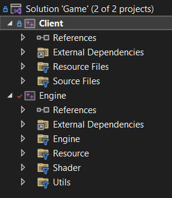
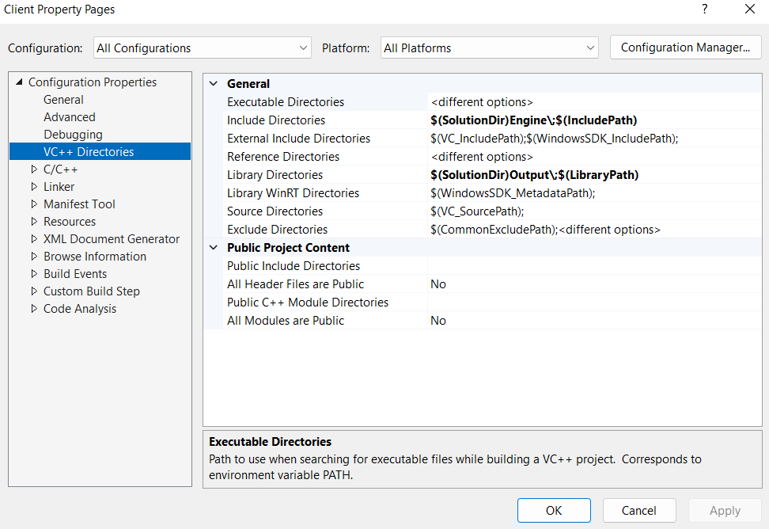
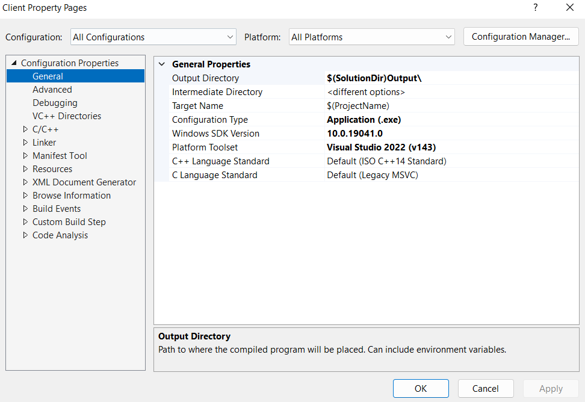
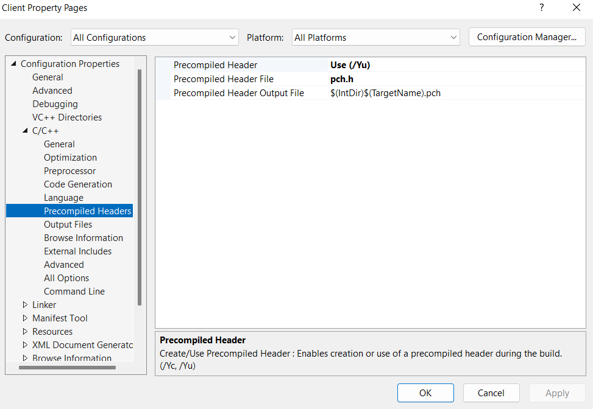
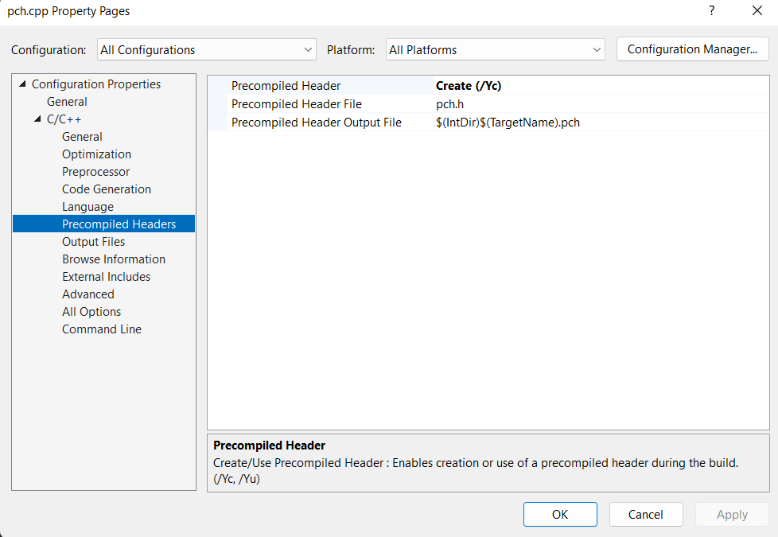
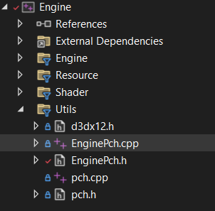
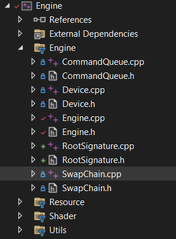
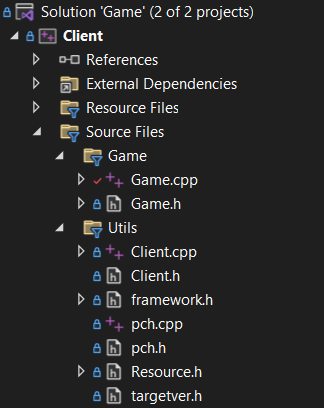

<br>


## 🙇‍♀️Constant BUffer


<br>


### 🪐CPU VS GPU
# 2022_10_04_장치 초기화 코드

---

### 🚀 프로젝트 세팅

DirectX 12 공부를 하기 위한 장치 초기화까지의 코드.

교재는 플랭크 D.루나의 `DirectX 12를 이용한 3D 게임 프로그래밍 입문` 을 사용하고, 인터넷 강의로는 인프런에 Rookiss의 `[C++과 언리얼로 만드는 MMORPG 게임 개발 시리즈] Part2: 게임 수학과 DirectX12` 로 공부한다.

프로젝트는 `Windows Desktop Application` 을 생성한다. (윈도우 창이 뜨는 것 까지 자동 완성)

코드는 `Client`와 `Engine`으로 나뉘어져 있으며 `Engine`은 `Static Library`이다.



`Static Library`는 프로젝트 추가 생성할 때 선택을 하고 `Client`에서 `Engine`을 사용하기 위해서는 `Client` 속성에서 `Engine.h`와 `Engine.lib`을 연결해주고 `link`까지 해줘야 한다.



`Include Directories` 에는 `h`파일을 넣어주고 `Library Directories` 에는 `lib`파일을 넣어줘야 한다.

`link`는 속성에서 추가 할 수 있지만 보통 `#pragma comment(lib, "Engine.lib")` 을 사용한다. 위에 과정은 `lib` 가 어디 있는지 알려주는 것이고 직접적인 연결은 `pragma comment` 가 한다고 생각하면 된다.

 

참고로 빌드 후 나온 결과물 즉, `Engine.lib`와 `Client.exe`파일은 `Output`폴더에 나오도록 설정했다.



`Output Directory`에 경로를 설정하는게 첨언하자면 상대적인 경로로 설정해야 좋기에 `$(SolutionDir)`에서 `Output`폴더로 설정했다. `$(SolutionDir)`는 프로젝트 솔루션 파일 즉, `sln`파일이 있는 폴더를 말한다.

---

### 🚀 PCH

`PreCompiled Header` 의 약자로 각종 헤더파일을 모아 놓고 사용가능하다.

`Client`와 `Engine`모두 사용 할 것이므로 둘 다 추가 해줘야한다.



`Precompiled Header`를 사용을 바꾸고 파일 이름을 원하는 이름으로 정하면 되는데 `Precompiled Header`의 약자인 `pch`로 정했다.



`pch` 클래스를 생성하고 `cpp`에 속성에서 `Use`가 아니라 `Create`로 설정해줘야한다.

이렇게 되면 `pch` 사용 준비는 끝난다.

**pch.h는 모는 cpp파일에서 사용해야 하고 무조건 첫 줄에 적어야 한다.**

---

### 🚀 프로젝트 세팅

프로젝트 세팅으로 `pch` 파일 추가와 `EnginePch, d3dx12, Game class` 추가가 있다.

먼저 `Engine`부터 만들어보자.

1. **pch**

```cpp
// pch.h

#ifndef PCH_H
#define PCH_H

// 여기에 미리 컴파일하려는 헤더 추가
#define WIN32_LEAN_AND_MEAN // 거의 사용되지 않는 내용을 Windows 헤더에서 제외합니다.

#include "EnginePch.h"

#endif //PCH_H
```

여기에서 볼건 `#include "EnginePch.h"` 부분이다 `EnginePch` 를 따로 뺸걸 볼 수 있는데 다른 `#ifdef` 등등과 섞이지 않게 깔끔하게 내가 사용하는 것들만 모으려고 따로 뺐다.

`pch.cpp`에서는 `#include pch.h` 만 넣고 아무것도 없다.

1. **d3dx12**

`d3dx12.h` 는 마이크로소프트에서 지원하는 `directX helper` 파일이다. 사용하기 위해서는 구글에 검색 후 github에서 파일을 다운 받고 내 프로젝트에 삽입하면 된다.

1. **EnginePch**

```cpp
// EnginePch.h

#pragma once

// 각종 include
#include <windows.h>
#include <tchar.h>
#include <memory>
#include <string>
#include <vector>
#include <array>
#include <list>
#include <map>
using namespace std;

#include "d3dx12.h"
#include <d3d12.h>
#include <wrl.h>
#include <d3dcompiler.h>
#include <dxgi.h>
#include <DirectXMath.h>
#include <DirectXPackedVector.h>
#include <DirectXColors.h>
using namespace DirectX;
using namespace DirectX::PackedVector;
using namespace Microsoft::WRL;

// 각종 lib
#pragma comment(lib, "d3d12")
#pragma comment(lib, "dxgi")
#pragma comment(lib, "dxguid")
#pragma comment(lib, "d3dcompiler")

// 각종 typedef
using int8		= __int8;
using int16		= __int16;
using int32		= __int32;
using int64		= __int64;
using uint8		= unsigned __int8;
using uint16	= unsigned __int16;
using uint32	= unsigned __int32;
using uint64	= unsigned __int64;
using Vec2		= XMFLOAT2;
using Vec3		= XMFLOAT3;
using Vec4		= XMFLOAT4;
using Matrix	= XMMATRIX;

enum
{
	SWAP_CHAIN_BUFFER_COUNT = 2,
};

struct WindowInfo
{
	HWND	hwnd;
	uint32	width;
	uint32	height;
	bool	windowed;
};

#define DEVICE GEngine->GetDevice()->GetDevice()
#define CMD_LIST GEngine->GetCmdQueue()->GetCmdList()

extern unique_ptr<class Engine> GEngine;
```

```cpp
// EnginePch.cpp

#include "pch.h"
#include "EnginePch.h"
#include "Engine.h"

unique_ptr<Engine> GEngine = make_unique<Engine>();
```

헤더파일에서 각종 편리하게 다른 헤더파일을 넣은것과 링크시켜주기가 있고 `using` 을 사용한 `typedef` 이 있다. 또, `enum` 과 `struct WindowInfo` 는 나중에 필요한 것들이고 `#define` 으로 매크로 함수까지 있다. 마지막으로 `unique_ptr` 스마트 포인터로 Engine을 전역으로 들고 있게 만들었다.

전역인건 `EnginePch.cpp`에서 전역변수로 만든걸 알 수 있다.

- **unique_ptr 스마트포인터 복습**
    
    [https://learn.microsoft.com/ko-kr/cpp/cpp/how-to-create-and-use-unique-ptr-instances?view=msvc-170](https://learn.microsoft.com/ko-kr/cpp/cpp/how-to-create-and-use-unique-ptr-instances?view=msvc-170) (마소 공식 학습장)
    
     `unique_ptr`은 포인터를 공유하지 않습니다. 다른 `unique_ptr`함수에 복사하거나, 값으로 함수에 전달하거나, 복사본을 생성해야 하는 C++ 표준 라이브러리 알고리즘에서 사용할 수 없습니다.  말그대로 독립적인 스마트포인터이다.
    
    1. **인스턴스 생성과 함수사이에서의 전달**
    
    ```cpp
    unique_ptr<Song> SongFactory(const std::wstring& artist, const std::wstring& title)
    {
        // Implicit move operation into the variable that stores the result.
        return make_unique<Song>(artist, title);
    }
    
    void MakeSongs()
    {
        // Create a new unique_ptr with a new object.
        auto song = make_unique<Song>(L"Mr. Children", L"Namonaki Uta");
    
        // Use the unique_ptr.
        vector<wstring> titles = { song->title };
    
        // Move raw pointer from one unique_ptr to another.
        unique_ptr<Song> song2 = std::move(song);
    
        // Obtain unique_ptr from function that returns by value.
        auto song3 = SongFactory(L"Michael Jackson", L"Beat It");
    }
    ```
    
    1. **인스턴스 생성과 벡터에서의 사용**
    
    ```cpp
    void SongVector()
    {
        vector<unique_ptr<Song>> songs;
        
        // Create a few new unique_ptr<Song> instances
        // and add them to vector using implicit move semantics.
        songs.push_back(make_unique<Song>(L"B'z", L"Juice")); 
        songs.push_back(make_unique<Song>(L"Namie Amuro", L"Funky Town")); 
        songs.push_back(make_unique<Song>(L"Kome Kome Club", L"Kimi ga Iru Dake de")); 
        songs.push_back(make_unique<Song>(L"Ayumi Hamasaki", L"Poker Face"));
    
        // Pass by const reference when possible to avoid copying.
        for (const auto& song : songs)
        {
            wcout << L"Artist: " << song->artist << L"   Title: " << song->title << endl; 
        }    
    }
    ```
    
    1. **클래스 멤버인 `unique_ptr` 초기화**
    
    ```cpp
    class MyClass
    {
    private:
        // MyClass owns the unique_ptr.
        unique_ptr<ClassFactory> factory;
    public:
    
        // Initialize by using make_unique with ClassFactory default constructor.
        MyClass() : factory (make_unique<ClassFactory>())
        {
        }
    
        void MakeClass()
        {
            factory->DoSomething();
        }
    };
    ```
    



`Utils` 필터에 분류했다.

---

### 🚀 Engine 부품 만들기

장치 초기화에서의 `Engine`의 부품은  `Engine, Device, CommandQueue, SwapChain, Engine` 이 있다.

하나하나의 `h와 cpp` 을 복붙하고 부가적인 설명을 하겠다. `DirectX` 는 전체가 맞물려서 공부해야되므로 아직 설명하지 않은 부분이라도 아는것처럼 설명 할 것이다.

1. **Engine**

```cpp
#pragma once

#include "Device.h"
#include "CommandQueue.h"
#include "SwapChain.h"

class Engine
{
public:
	void Init(const WindowInfo& info);
	void Render();

public:
	shared_ptr<Device> GetDevice() { return _device; }
	shared_ptr<CommandQueue> GetCmdQueue() { return _cmdQueue; }
	shared_ptr<SwapChain> GetSwapChain() { return _swapChain; }

public:
	void RenderBegin();
	void RenderEnd();
	
	void ResizeWindow(uint32 width, uint32 height);
private:
	WindowInfo		_window;
	D3D12_VIEWPORT	_viewport = {};
	D3D12_RECT		_scissorRect = {};

	shared_ptr<Device>			_device = make_shared<Device>();
	shared_ptr<CommandQueue>	_cmdQueue = make_shared<CommandQueue>();
	shared_ptr<SwapChain>		_swapChain = make_shared<SwapChain>();
};
```

헤더파일에 헤더파일을 넣는 것은 좋지 않은 습관이지만 편리함을 위해서 넣었다. 이렇게하면 `Engine.h`만 추가해도 나머지 헤더파일을 사용 할 수 있다.

`Device, CommandQueue, SwapChain`을 멤버 변수로 들고 있으며 생성도 한다. 또, `Get`으로 모두 빼올수 있게 만들었다. 이렇게 한다면 프로젝트 세팅 때 `unique_ptr GEngine` 인 전역 `Engine` 으로 모두 빼올수 있다는 편리함이 생긴다.

창 설정에 필요한 `WindowInfo _window;` `D3D12_VIEWPORT	_viewport = {};` `D3D12_RECT _scissorRect = {};` 을 멤버 변수로 들고 있다.

`Init, Render, RenderBegin, RenderEnd, ResizeWindow` 함수가 있으며 `RenderBegin, RenderEnd` 은 `CommandQueue` 를 통해서 사용하게 된다. `ResizeWindow` 는 혹시라도 창 사이즈를 바꿀 수 있으니 만들어진 함수이고 입력에 따라 변하게 인자를 받는다.

 

```cpp
#include "pch.h"
#include "Engine.h"

void Engine::Init(const WindowInfo& info)
{
	_window = info;
	ResizeWindow(info.width, info.height);

	_viewport = { 0, 0, static_cast<FLOAT>(info.width), static_cast<FLOAT>(info.height), 0.0f, 1.0f };
	_scissorRect = CD3DX12_RECT(0, 0, info.width, info.height);

	_device->Init();
	_cmdQueue->Init(_device->GetDevice(), _swapChain);
	_swapChain->Init(info, _device->GetDevice(), _device->GetDXGI(), _cmdQueue->GetCmdQueue());
}

void Engine::Render()
{
	RenderBegin();

	// TODO Reder

	RenderEnd();
}

void Engine::RenderBegin()
{
	_cmdQueue->RenderBegin(&_viewport, &_scissorRect);
}

void Engine::RenderEnd()
{
	_cmdQueue->RenderEnd();
}

void Engine::ResizeWindow(uint32 width, uint32 height)
{
	_window.width = width;
	_window.height = height;

	RECT rect = { 0, 0, width, height };
	::AdjustWindowRect(&rect, WS_OVERLAPPEDWINDOW, false);
	::SetWindowPos(_window.hwnd, 0, 100, 100, width, height, 0);
}
```

`Init` 에서 참조값으로 `WindowInfo` 를 받고 있다. (진퉁으로 작업) 멤버 변수를 대입해주고 입력된 `info` 의 `width height` 로 `ResizeWindow` 를 해준다. `_viewport _scissorRect` 는 원하는 인자에 맞게 대입한 것이고 그 뒤에 멤버변수로 들고 있던 `Device, CommandQueue, SwapChain` 의 `Init` 함수를 실행한다. 이렇게 하면 `Engine` 의 `Init` 만 하면 나머지도 자동으로 된다.

나머지는 그냥 그렇다.

1. **Device**

```cpp
#pragma once

class Device
{
public:
	void Init();

	ComPtr<IDXGIFactory> GetDXGI() { return _dxgi; }
	ComPtr<ID3D12Device> GetDevice() { return _device; }

private:
	ComPtr<ID3D12Debug>		_debugController;
	ComPtr<IDXGIFactory>	_dxgi;
	ComPtr<ID3D12Device>	_device;

};
```

`Init`함수와 멤버 변수 뺴올수있는 함수가 있다.

`ComPtr<ID3D12Debug> _debugController;` 는 디버그용으로 있는것.

`ComPtr<IDXGIFactory> _dxgi;` 는 실질적으로 그릴 화면과 관련 돼있다.

`ComPtr<ID3D12Device> _device;` 디바이스는 들고 있어야 된다.

- **ComPtr 과 IDXGIFactory**
    1. **ComPtr**
    
    `ComPtr` 객체는 `Component Object Model Pointer` 의 약자로 `DirectX` 의 프로그래밍 언어 독립성과 하위 호환성을 가능하게 하는 기술이다. 이게 무슨 말이냐면 쉽게 말해서 그래픽 카드를 사용하게 하는 언어다.  마소는 그래픽 카드를 다른 회사걸 사용하는데 그래픽 카드의 언어는 회사마다 다르지만 마소에서 정해 놓은 규격, 언어로 통일화해서 우리는 각각의 그래픽 언어를 알 필요가 없다. `DirectX` 는 그런 용도이고 `ComPtr` 은 그렇게 하는 도구라고 생각하자.
    
    1. **IDXGIFactory**
    
    `ComPtr` 인터페이스들은 `I` 가 붙는다.  `DXGI` 는 `DirectX Graphics Infrastructure` 의 약자로 `Direct3D` 와 함께 쓰이는 API이다. 이것은 여러 그래픽 API들에 공통인 그래픽 관련 작업들이 존재한다. `IDXGISwapChain` 인터페이스 생성과 디스플레이 어댑터 열거에 쓰인다.
    

```cpp
#include "pch.h"
#include "Device.h"

void Device::Init()
{
#ifdef DEBUG
	::D3D12GetDebugInterface(IID_PPV_ARGS(&_debugController));
	_debugController->EnableDebugLayer();
#endif // DEBUG

	::CreateDXGIFactory(IID_PPV_ARGS(&_dxgi));

	::D3D12CreateDevice(nullptr, D3D_FEATURE_LEVEL_11_0, IID_PPV_ARGS(&_device));
}
```

처음에 나오는 함수는 디버그용으로 책에서 나온거랑 똑같이 적은거다.

그 뒤 나오는 `::CreateDXGIFactory(IID_PPV_ARGS(&_dxgi));` 로 화면관련 사용할것들을 만든다.

인자로 `IID_PPV_ARGS(&_dxgi)` 를 받는데 `IID_PPV_ARGS` 는 매크로로써 `#define IID_PPV_ARGS(ppType) __uuidof(**(ppType)), IID_PPV_ARGS_Helper(ppType)` 이렇게 마소에서 만든 매크로인걸 알 수 있다. 뱉는 것은 `riid : 디바이스의 COM ID`, `ppDevice : 생성된 장치가 매개변수에 설정` 을 뱉는다.

`D3D12CreateDevice` 에서는 어댑터 포인터와 최소수준레벨 IID_PPV_ARGS를 받는다. 어댑터는 `nullptr` 이다. 최소수준레벨이란 사용자가 최소한 이정도는 되야된다 인데 그래픽카드의 수준을 말한다. 그래픽카드가 최소한 directX11까지는 지원해야 프로그램이 돌아간다는 뜻이다.

1. **CommandQueue**

```cpp
#pragma once

class CommandQueue
{
public:
	~CommandQueue();

	void Init(ComPtr<ID3D12Device> device, shared_ptr<class SwapChain> swapChain);
	void WaitSync();

	void RenderBegin(const D3D12_VIEWPORT* vp, const D3D12_RECT* rect);
	void RenderEnd();

	ComPtr<ID3D12CommandQueue> GetCmdQueue() { return _cmdQueue; }
	ComPtr<ID3D12GraphicsCommandList> GetCmdList() { return _cmdList; }

private:
	ComPtr<ID3D12CommandQueue>		_cmdQueue;
	ComPtr<ID3D12CommandAllocator>	_cmdAlloc;
	ComPtr<ID3D12GraphicsCommandList>		_cmdList;

	ComPtr<ID3D12Fence>					_fence;
	uint32								_fenceValue = 0;
	HANDLE								_fenceEvent = INVALID_HANDLE_VALUE;

	shared_ptr<class SwapChain>			_swapChain;
};
```

`DX12`부터 나온 개념으로 일감들을 `Queue`에 쌓아 놓고 나중에 한꺼번에 일을 맡기는 방식이다.

`RenderBegin`으로 일감들을 받기 시작하고 `RenderEnd`로 일감 받는 문을 닫고 일을 넘긴다.

여기서 `ID3D12CommandQueue, ID3D12CommandAllocator, ID3D12GraphicsCommandList`는 한 세트라고 생각하면 된다.

`Fence`는 동기화를 위한 작업으로 일감들을 받아 들이고 있을 떄 (read) 일감들을 사용하는것(write)이 불가능하게 되어있다. `Fence`는 이런 상황을 방지 하도록 `GPU`의 작업이 다 끝날 때 까지는 `CPU`가 가만히 있도록 만든다. 물론 좋은 방법은 아니다.

```cpp
#include "pch.h"
#include "CommandQueue.h"
#include "SwapChain.h"

CommandQueue::~CommandQueue()
{
	::CloseHandle(_fenceEvent);
}
// 소멸자 생성시 fenceEvent 꺼주기

void CommandQueue::Init(ComPtr<ID3D12Device> device, shared_ptr<class SwapChain> swapChain)
{
	_swapChain = swapChain;

	D3D12_COMMAND_QUEUE_DESC queueDesc = {};
	queueDesc.Type = D3D12_COMMAND_LIST_TYPE_DIRECT;
	queueDesc.Flags = D3D12_COMMAND_QUEUE_FLAG_NONE;

	device->CreateCommandQueue(&queueDesc, IID_PPV_ARGS(&_cmdQueue));

	device->CreateCommandAllocator(D3D12_COMMAND_LIST_TYPE_DIRECT, IID_PPV_ARGS(&_cmdAlloc));

	device->CreateCommandList(0, D3D12_COMMAND_LIST_TYPE_DIRECT, _cmdAlloc.Get(), nullptr, IID_PPV_ARGS(&_cmdList));

	_cmdList->Close();

	device->CreateFence(_fenceValue, D3D12_FENCE_FLAG_NONE, IID_PPV_ARGS(&_fence));
	_fenceEvent = ::CreateEvent(nullptr, FALSE, FALSE, nullptr);
}

// 멤버변수 swapChain 넣기
// CreateCommandQueue를 하기 위한 D3D12_COMMAND_QUEUE_DESC 작성
// CreateCommandAloocator와 CreateCommandList로 세트 생성
// 이 때 생성은 device에서 출발한다. device는 ComPtr로 받고있음
// 이렇게 세트를 만들고 설정하면 cmdList에서 close를 해야 됨
// 그 후 fence와 fenceEvent를 만들었음

void CommandQueue::WaitSync()
{
	_fenceValue++;

	_cmdQueue->Signal(_fence.Get(), _fenceValue);

	if (_fence->GetCompletedValue() < _fenceValue)
	{
		_fence->SetEventOnCompletion(_fenceValue, _fenceEvent);

		::WaitForSingleObject(_fenceEvent, INFINITE);
	}
}
// 여기서의 주된 작업은 일감 기다리기이다.
// fenceValue++ : 기다릴 일감 추가
// Signal : 신호대기중
// 일감 끝나면 완료!

void CommandQueue::RenderBegin(const D3D12_VIEWPORT* vp, const D3D12_RECT* rect)
{
	_cmdAlloc->Reset();
	_cmdList->Reset(_cmdAlloc.Get(), nullptr);

	D3D12_RESOURCE_BARRIER barrier = CD3DX12_RESOURCE_BARRIER::Transition(
		_swapChain->GetCurrentBackBufferResource().Get(),
		D3D12_RESOURCE_STATE_PRESENT, // 화면 출력
		D3D12_RESOURCE_STATE_RENDER_TARGET); // 외주 결과물

	_cmdList->ResourceBarrier(1, &barrier);

	// Set the viewport and scissor rect.  This needs to be reset whenever the command list is reset.
	_cmdList->RSSetViewports(1, vp);
	_cmdList->RSSetScissorRects(1, rect);

	// Specify the buffers we are going to render to.
	D3D12_CPU_DESCRIPTOR_HANDLE backBufferView = _swapChain->GetBackRTV();
	_cmdList->ClearRenderTargetView(backBufferView, Colors::LightSteelBlue, 0, nullptr);
	_cmdList->OMSetRenderTargets(1, &backBufferView, FALSE, nullptr);
}
// cmdAlloc, cmdList를 초기화
// barrier를 생성하는데 인자를 자세히 보면 swapChain에서 현재 BackBufferRescoure를 가져오고
// 현재 화면과 뒷화면을 인자로 받는다.
// 알맞은 인자 세팅 후 화면의 viewPort와 scissorRect를 다시 세팅한다.
// 이렇게 하면 문은 열린거고 이제 작업을 넣는데 swapChain에서 BackRenderTargetView를 가져와서
// 화면을 LightSteelBlue색으로 설정
// RenderTarget을 설정

void CommandQueue::RenderEnd()
{
	D3D12_RESOURCE_BARRIER barrier = CD3DX12_RESOURCE_BARRIER::Transition(
		_swapChain->GetCurrentBackBufferResource().Get(),
		D3D12_RESOURCE_STATE_RENDER_TARGET, // 외주 결과물
		D3D12_RESOURCE_STATE_PRESENT); // 화면 출력

	_cmdList->ResourceBarrier(1, &barrier);
	_cmdList->Close();
}
// Begin에서와 반대로 뒷화면과 현재화면을 받는다.
// swapChain에서 배운 double buffering을 표현하는 것.
// 다시 화면을 설정하고
// 일감 문 닫기
```

너무 많아서 함수 밑에 부가적이 설명으로 대체

1. **SwapChain**

```cpp
#pragma once

class SwapChain
{
public:
	void Init(const WindowInfo& info, ComPtr<ID3D12Device> device, ComPtr<IDXGIFactory> dxgi, ComPtr<ID3D12CommandQueue> cmdQueue);
	void Present();
	void SwapIndex();

	ComPtr<IDXGISwapChain> GetSwapChain() { return _swapChain; }
	ComPtr<ID3D12Resource> GetRenderTarget(int32 index) { return _rtvBuffer[index]; }

	uint32 GetBackRTVBuffer() { return _backBufferIndex; }
	ComPtr<ID3D12Resource> GetCurrentBackBufferResource() { return _rtvBuffer[_backBufferIndex]; }

	D3D12_CPU_DESCRIPTOR_HANDLE GetBackRTV() { return _rtvHandle[_backBufferIndex]; }
	

private:
	void CreateSwapChain(const WindowInfo& info, ComPtr<IDXGIFactory> dxgi, ComPtr<ID3D12CommandQueue> cmdQueue);
	void CreateRTV(ComPtr<ID3D12Device> device);

private:
	ComPtr<IDXGISwapChain>			_swapChain;

	ComPtr<ID3D12Resource>			_rtvBuffer[SWAP_CHAIN_BUFFER_COUNT];
	ComPtr<ID3D12DescriptorHeap>	_rtvHeap;
	D3D12_CPU_DESCRIPTOR_HANDLE		_rtvHandle[SWAP_CHAIN_BUFFER_COUNT];

	uint32							_backBufferIndex = 0;
};
```

아 더블 버퍼링은 완벽하게 이해했으니 생략…

```cpp
#include "pch.h"
#include "SwapChain.h"

void SwapChain::Init(const WindowInfo& info, ComPtr<ID3D12Device> device, ComPtr<IDXGIFactory> dxgi, ComPtr<ID3D12CommandQueue> cmdQueue)
{
	CreateSwapChain(info, dxgi, cmdQueue);
	CreateRTV(device);
}

void SwapChain::Present()
{
	_swapChain->Present(0, 0);
}

void SwapChain::SwapIndex()
{
	_backBufferIndex = (_backBufferIndex + 1) % SWAP_CHAIN_BUFFER_COUNT;
}

void SwapChain::CreateSwapChain(const WindowInfo& info, ComPtr<IDXGIFactory> dxgi, ComPtr<ID3D12CommandQueue> cmdQueue)
{
	_swapChain.Reset();

	DXGI_SWAP_CHAIN_DESC sd;
	sd.BufferDesc.Width = static_cast<uint32>(info.width); // 버퍼의 해상도 너비
	sd.BufferDesc.Height = static_cast<uint32>(info.height); // 버퍼의 해상도 높이
	sd.BufferDesc.RefreshRate.Numerator = 60; // 화면 갱신 비율
	sd.BufferDesc.RefreshRate.Denominator = 1; // 화면 갱신 비율
	sd.BufferDesc.Format = DXGI_FORMAT_R8G8B8A8_UNORM; // 버퍼의 디스플레이 형식
	sd.BufferDesc.ScanlineOrdering = DXGI_MODE_SCANLINE_ORDER_UNSPECIFIED;
	sd.BufferDesc.Scaling = DXGI_MODE_SCALING_UNSPECIFIED;
	sd.SampleDesc.Count = 1; // 멀티 샘플링 OFF
	sd.SampleDesc.Quality = 0;
	sd.BufferUsage = DXGI_USAGE_RENDER_TARGET_OUTPUT; // 후면 버퍼에 렌더링할 것 
	sd.BufferCount = SWAP_CHAIN_BUFFER_COUNT; // 전면+후면 버퍼
	sd.OutputWindow = info.hwnd;
	sd.Windowed = info.windowed;
	sd.SwapEffect = DXGI_SWAP_EFFECT_FLIP_DISCARD; // 전면 후면 버퍼 교체 시 이전 프레임 정보 버림
	sd.Flags = DXGI_SWAP_CHAIN_FLAG_ALLOW_MODE_SWITCH;

	dxgi->CreateSwapChain(cmdQueue.Get(), &sd, &_swapChain);

	for (int32 i = 0; i < SWAP_CHAIN_BUFFER_COUNT; i++)
		_swapChain->GetBuffer(i, IID_PPV_ARGS(&_rtvBuffer[i]));
}

void SwapChain::CreateRTV(ComPtr<ID3D12Device> device)
{

	// Descriptor (DX12) = View (~DX11)
	// [서술자 힙]으로 RTV 생성
	// DX11의 RTV(RenderTargetView), DSV(DepthStencilView), 
	// CBV(ConstantBufferView), SRV(ShaderResourceView), UAV(UnorderedAccessView)를 전부!

	int32 rtvHeapSize = device->GetDescriptorHandleIncrementSize(D3D12_DESCRIPTOR_HEAP_TYPE_RTV);

	D3D12_DESCRIPTOR_HEAP_DESC rtvDesc;
	rtvDesc.Type = D3D12_DESCRIPTOR_HEAP_TYPE_RTV;
	rtvDesc.NumDescriptors = SWAP_CHAIN_BUFFER_COUNT;
	rtvDesc.Flags = D3D12_DESCRIPTOR_HEAP_FLAG_NONE;
	rtvDesc.NodeMask = 0;

	// 같은 종류의 데이터끼리 배열로 관리
	// RTV 목록 : [ ] [ ]
	device->CreateDescriptorHeap(&rtvDesc, IID_PPV_ARGS(&_rtvHeap));

	D3D12_CPU_DESCRIPTOR_HANDLE rtvHeapBegin = _rtvHeap->GetCPUDescriptorHandleForHeapStart();

	for (int i = 0; i < SWAP_CHAIN_BUFFER_COUNT; i++)
	{
		_rtvHandle[i] = CD3DX12_CPU_DESCRIPTOR_HANDLE(rtvHeapBegin, i * rtvHeapSize);
		device->CreateRenderTargetView(_rtvBuffer[i].Get(), nullptr, _rtvHandle[i]);
	}
}
```

이렇게 하면 `Engine` 기본 뼈대 완성



여기서 `RootSignature`만 없는 상황. 이제 `Client`로 넘어가서 실제로 사용을 해야 됨.

---

### 🚀 Client에서 테스트



구조는 이렇게 될 것이다.

pch는 앞서 설명한 것처럼

```cpp
#pragma once

#pragma comment(lib, "Engine.lib")

#include "EnginePch.h"
```

이렇게 들고있고 cpp파일도 `#include "pch.h"` 만 있다.

알아볼것은 `Game class, Client class`만 분석 할 것이다.

1. **Client**

```cpp
// Client.cpp : 애플리케이션에 대한 진입점을 정의합니다.
//
#include "pch.h"
#include "framework.h"
#include "Client.h"
#include "Game.h"

#define MAX_LOADSTRING 100

// 전역 변수:
WindowInfo GWindowInfo; // WindowInfo 넣어줬음

HINSTANCE hInst;                                // 현재 인스턴스입니다.
WCHAR szTitle[MAX_LOADSTRING];                  // 제목 표시줄 텍스트입니다.
WCHAR szWindowClass[MAX_LOADSTRING];            // 기본 창 클래스 이름입니다.

// 이 코드 모듈에 포함된 함수의 선언을 전달합니다:
ATOM                MyRegisterClass(HINSTANCE hInstance);
BOOL                InitInstance(HINSTANCE, int);
LRESULT CALLBACK    WndProc(HWND, UINT, WPARAM, LPARAM);
INT_PTR CALLBACK    About(HWND, UINT, WPARAM, LPARAM);

int APIENTRY wWinMain(_In_ HINSTANCE hInstance,
                     _In_opt_ HINSTANCE hPrevInstance,
                     _In_ LPWSTR    lpCmdLine,
                     _In_ int       nCmdShow)
{
    UNREFERENCED_PARAMETER(hPrevInstance);
    UNREFERENCED_PARAMETER(lpCmdLine);

    // TODO: 여기에 코드를 입력합니다.

    // 전역 문자열을 초기화합니다.
    LoadStringW(hInstance, IDS_APP_TITLE, szTitle, MAX_LOADSTRING);
    LoadStringW(hInstance, IDC_CLIENT, szWindowClass, MAX_LOADSTRING);
    MyRegisterClass(hInstance);

    // 애플리케이션 초기화를 수행합니다:
    if (!InitInstance (hInstance, nCmdShow))
    {
        return FALSE;
    }

    HACCEL hAccelTable = LoadAccelerators(hInstance, MAKEINTRESOURCE(IDC_CLIENT));

    MSG msg;
// WindowInfo 인자 설정
    GWindowInfo.width = 800;
    GWindowInfo.height = 600;
    GWindowInfo.windowed = true;

    unique_ptr<Game> game = make_unique<Game>(); // Game 들고있기
    game->Init(GWindowInfo); // 시작

    // 기본 메시지 루프입니다:
    while (true)
    {
        if (PeekMessage(&msg, nullptr, 0, 0, PM_REMOVE))
        {
            if (msg.message == WM_QUIT)
                break;

			if (!TranslateAccelerator(msg.hwnd, hAccelTable, &msg))
			{
				TranslateMessage(&msg);
				DispatchMessage(&msg);
			}
        }

		// TODO
        game->Update(); // 업데이트
    }

    return (int) msg.wParam;
}

//
//  함수: MyRegisterClass()
//
//  용도: 창 클래스를 등록합니다.
//
ATOM MyRegisterClass(HINSTANCE hInstance)
{
    WNDCLASSEXW wcex;

    wcex.cbSize = sizeof(WNDCLASSEX);

    wcex.style          = CS_HREDRAW | CS_VREDRAW;
    wcex.lpfnWndProc    = WndProc;
    wcex.cbClsExtra     = 0;
    wcex.cbWndExtra     = 0;
    wcex.hInstance      = hInstance;
    wcex.hIcon          = LoadIcon(hInstance, MAKEINTRESOURCE(IDI_CLIENT));
    wcex.hCursor        = LoadCursor(nullptr, IDC_ARROW);
    wcex.hbrBackground  = (HBRUSH)(COLOR_WINDOW+1);
    wcex.lpszMenuName   = nullptr;
    wcex.lpszClassName  = szWindowClass;
    wcex.hIconSm        = LoadIcon(wcex.hInstance, MAKEINTRESOURCE(IDI_SMALL));

    return RegisterClassExW(&wcex);
}

//
//   함수: InitInstance(HINSTANCE, int)
//
//   용도: 인스턴스 핸들을 저장하고 주 창을 만듭니다.
//
//   주석:
//
//        이 함수를 통해 인스턴스 핸들을 전역 변수에 저장하고
//        주 프로그램 창을 만든 다음 표시합니다.
//
BOOL InitInstance(HINSTANCE hInstance, int nCmdShow)
{
   hInst = hInstance; // 인스턴스 핸들을 전역 변수에 저장합니다.

   HWND hWnd = CreateWindowW(szWindowClass, szTitle, WS_OVERLAPPEDWINDOW,
      CW_USEDEFAULT, 0, CW_USEDEFAULT, 0, nullptr, nullptr, hInstance, nullptr);

   if (!hWnd)
   {
      return FALSE;
   }

   ShowWindow(hWnd, nCmdShow);
   UpdateWindow(hWnd);
   
   GWindowInfo.hwnd = hWnd; // 창 설정

   return TRUE;
}

//
//  함수: WndProc(HWND, UINT, WPARAM, LPARAM)
//
//  용도: 주 창의 메시지를 처리합니다.
//
//  WM_COMMAND  - 애플리케이션 메뉴를 처리합니다.
//  WM_PAINT    - 주 창을 그립니다.
//  WM_DESTROY  - 종료 메시지를 게시하고 반환합니다.
//
//
LRESULT CALLBACK WndProc(HWND hWnd, UINT message, WPARAM wParam, LPARAM lParam)
{
    switch (message)
    {
    case WM_COMMAND:
        {
            int wmId = LOWORD(wParam);
            // 메뉴 선택을 구문 분석합니다:
            switch (wmId)
            {
            case IDM_ABOUT:
                DialogBox(hInst, MAKEINTRESOURCE(IDD_ABOUTBOX), hWnd, About);
                break;
            case IDM_EXIT:
                DestroyWindow(hWnd);
                break;
            default:
                return DefWindowProc(hWnd, message, wParam, lParam);
            }
        }
        break;
    case WM_PAINT:
        {
            PAINTSTRUCT ps;
            HDC hdc = BeginPaint(hWnd, &ps);
            // TODO: 여기에 hdc를 사용하는 그리기 코드를 추가합니다...
            EndPaint(hWnd, &ps);
        }
        break;
    case WM_DESTROY:
        PostQuitMessage(0);
        break;
    default:
        return DefWindowProc(hWnd, message, wParam, lParam);
    }
    return 0;
}

// 정보 대화 상자의 메시지 처리기입니다.
INT_PTR CALLBACK About(HWND hDlg, UINT message, WPARAM wParam, LPARAM lParam)
{
    UNREFERENCED_PARAMETER(lParam);
    switch (message)
    {
    case WM_INITDIALOG:
        return (INT_PTR)TRUE;

    case WM_COMMAND:
        if (LOWORD(wParam) == IDOK || LOWORD(wParam) == IDCANCEL)
        {
            EndDialog(hDlg, LOWORD(wParam));
            return (INT_PTR)TRUE;
        }
        break;
    }
    return (INT_PTR)FALSE;
}
```

이것도 너무 길어서 주석으로 대체

1. **Game**

```cpp
#include "pch.h"
#include "Game.h"
#include "Engine.h"

void Game::Init(const WindowInfo& info)
{
	GEngine->Init(info);
}

void Game::Update()
{
	GEngine->Render();
}
```

게임에서 전역 변수 `GEngine`의 `Init`을 시작해서 `Engine`의 코드들 구동

`Update`에서 `GEngine`의 `Render`로 `CmdQueue`의 `RenderBegin, RenderEnd`를 실행함으로써 매 프레임마다 `RenderBegin, RenderEnd`이 반복된다. 우리가 화면 설정한 것은 `RenderBegin`에 있으므로 여기서 색이 나옴.

기본적인 장치 초기화가 끝났다.

---

### 🚀 장치 초기화의 결과


이게 결과..


