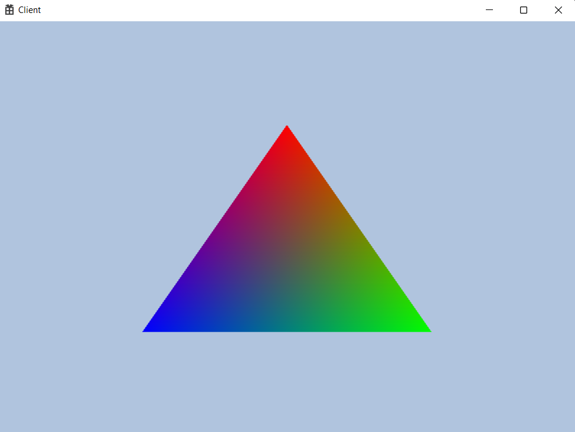

<br>

### 🐌 삼각형 띄우기

1. RootSignature
2. Mesh class
3. Shader class 및 hlsl(hlsli)

대략적으로 RootSignature는 삼각형 그리기를 할거라고 계약서를 만드는 것.

Mesh는 Vertex란 점으로 이루어진 물체(유니티짱의 점들)

Shader는 실질적으로 그릴 것들인데 shader class에는 가볍게 적고 진짜 그릴 명령들은 hlsl에 들어가게 된다.

일단은 코드 복붙하고 밑에 코드 분석을 하는 방식으로 진행해보자.

---

### 🚀 RootSignature

```cpp
#pragma once

class RootSignature
{
public:
	void Init(ComPtr<ID3D12Device> device);

	ComPtr<ID3D12RootSignature> GetSignature() { return _signature; }

private:
	ComPtr<ID3D12RootSignature>	_signature;
};
```

```cpp
#include "pch.h"
#include "RootSignature.h"

void RootSignature::Init(ComPtr<ID3D12Device> device)
{
	D3D12_ROOT_SIGNATURE_DESC sigDesc = CD3DX12_ROOT_SIGNATURE_DESC(D3D12_DEFAULT);
	sigDesc.Flags = D3D12_ROOT_SIGNATURE_FLAG_ALLOW_INPUT_ASSEMBLER_INPUT_LAYOUT; // 입력 조립기 단계

	ComPtr<ID3DBlob> blobSignature;
	ComPtr<ID3DBlob> blobError;
	::D3D12SerializeRootSignature(&sigDesc, D3D_ROOT_SIGNATURE_VERSION_1, &blobSignature, &blobError);
	device->CreateRootSignature(0, blobSignature->GetBufferPointer(), blobSignature->GetBufferSize(), IID_PPV_ARGS(&_signature));
}
```

---

[https://learn.microsoft.com/ko-kr/windows/win32/direct3d12/example-root-signatures](https://learn.microsoft.com/ko-kr/windows/win32/direct3d12/example-root-signatures)

마소 공식문서를 보면 `sigDesc.Flags = D3D12_ROOT_SIGNATURE_FLAG_ALLOW_INPUT_ASSEMBLER_INPUT_LAYOUT;` 은 입력 조립기 단계를 사용한다는 계약이고 나머지는 하는게 없는 빈깡통이다.

blob란 Binary Large Object의 약자로 binary 형태로 큰 객체를 저장한다.

### 🚀 Mesh

```cpp
#pragma once

class Mesh
{
public:
	void Init(vector<Vertex>& vec);
	void Render();

private:
	ComPtr<ID3D12Resource>		_vertexBuffer;
	D3D12_VERTEX_BUFFER_VIEW	_vertexBufferView = {};
	uint32						_vertexCount = 0;
};
```

```cpp
#include "pch.h"
#include "Mesh.h"
#include "Engine.h"

void Mesh::Init(vector<Vertex>& vec)
{
	_vertexCount = static_cast<uint32>(vec.size()); // 정점 개수
	uint32 bufferSize = _vertexCount * sizeof(Vertex); // 버퍼 크기

// 가볍게 D3D12_HEAP_TYPE_UPLOAD로 설정
	D3D12_HEAP_PROPERTIES heapProperty = CD3DX12_HEAP_PROPERTIES(D3D12_HEAP_TYPE_UPLOAD);
	D3D12_RESOURCE_DESC desc = CD3DX12_RESOURCE_DESC::Buffer(bufferSize);

// 앞으로 Resource를 설정한다? DEVICE->CreateCommittedResource()
	DEVICE->CreateCommittedResource(
		&heapProperty,
		D3D12_HEAP_FLAG_NONE,
		&desc,
		D3D12_RESOURCE_STATE_GENERIC_READ,
		nullptr,
		IID_PPV_ARGS(&_vertexBuffer));

// Map으로 일감 뚜껑 열기
// memcpy로 일감들 복사
// Unmap으로 일감 뚜껑 닫기
	void* vertexDataBuffer = nullptr;
	CD3DX12_RANGE readRange(0, 0);
	_vertexBuffer->Map(0, &readRange, &vertexDataBuffer);
	::memcpy(vertexDataBuffer, &vec[0], bufferSize);
	_vertexBuffer->Unmap(0, nullptr);

// GPU쪽으로 복사 되었기 때문에 view를 통해서 원격 조종
	_vertexBufferView.BufferLocation = _vertexBuffer->GetGPUVirtualAddress();
	_vertexBufferView.StrideInBytes = sizeof(Vertex);
	_vertexBufferView.SizeInBytes = bufferSize;
}

void Mesh::Render()
{
	CMD_LIST->IASetPrimitiveTopology(D3D_PRIMITIVE_TOPOLOGY_TRIANGLELIST);
	CMD_LIST->IASetVertexBuffers(0, 1, &_vertexBufferView);
	CMD_LIST->DrawInstanced(_vertexCount, 1, 0, 0);
}
```

---

### 🚀 Shader

```cpp
#pragma once

class Shader
{
public:
	void Init(const wstring& path);
	void Update();

private:
	void CreateShader(const wstring& path, const string& name, const string& version, ComPtr<ID3DBlob>& blob, D3D12_SHADER_BYTECODE& shaderByteCode);
	void CreateVertexShader(const wstring& path, const string& name, const string& version);
	void CreatePixelShader(const wstring& path, const string& name, const string& version);

private:
	ComPtr<ID3DBlob>					_vsBlob;
	ComPtr<ID3DBlob>					_psBlob;
	ComPtr<ID3DBlob>					_errBlob;

	ComPtr<ID3D12PipelineState>			_pipelineState;
	D3D12_GRAPHICS_PIPELINE_STATE_DESC	_pipelineDesc = {};
};
```

```cpp
#include "pch.h"
#include "Shader.h"
#include "Engine.h"

void Shader::Init(const wstring& path)
{
	CreateVertexShader(path, "VS_Main", "vs_5_0");
	CreatePixelShader(path, "PS_Main", "ps_5_0");

	D3D12_INPUT_ELEMENT_DESC desc[] =
	{
		{ "POSITION", 0, DXGI_FORMAT_R32G32B32_FLOAT, 0, 0, D3D12_INPUT_CLASSIFICATION_PER_VERTEX_DATA, 0 },
		{ "COLOR", 0, DXGI_FORMAT_R32G32B32A32_FLOAT, 0, 12, D3D12_INPUT_CLASSIFICATION_PER_VERTEX_DATA, 0 },
		{ "TEXCOORD", 0, DXGI_FORMAT_R32G32_FLOAT, 0, 28, D3D12_INPUT_CLASSIFICATION_PER_VERTEX_DATA, 0 },
	};

	_pipelineDesc.InputLayout = { desc, _countof(desc) };
	_pipelineDesc.pRootSignature = ROOT_SIGNATURE.Get();

	_pipelineDesc.RasterizerState = CD3DX12_RASTERIZER_DESC(D3D12_DEFAULT);
	_pipelineDesc.BlendState = CD3DX12_BLEND_DESC(D3D12_DEFAULT);
	_pipelineDesc.DepthStencilState = CD3DX12_DEPTH_STENCIL_DESC(D3D12_DEFAULT);
	_pipelineDesc.SampleMask = UINT_MAX;
	_pipelineDesc.PrimitiveTopologyType = D3D12_PRIMITIVE_TOPOLOGY_TYPE_TRIANGLE;
	_pipelineDesc.NumRenderTargets = 1;
	_pipelineDesc.RTVFormats[0] = DXGI_FORMAT_R8G8B8A8_UNORM;
	_pipelineDesc.SampleDesc.Count = 1;

	DEVICE->CreateGraphicsPipelineState(&_pipelineDesc, IID_PPV_ARGS(&_pipelineState));
}

void Shader::Update()
{
	CMD_LIST->SetPipelineState(_pipelineState.Get());
}

void Shader::CreateShader(const wstring& path, const string& name, const string& version, ComPtr<ID3DBlob>& blob, D3D12_SHADER_BYTECODE& shaderByteCode)
{
	uint32 compileFlag = 0;
#ifdef _DEBUG
	compileFlag = D3DCOMPILE_DEBUG | D3DCOMPILE_SKIP_OPTIMIZATION;
#endif

	if (FAILED(::D3DCompileFromFile(path.c_str(), nullptr, D3D_COMPILE_STANDARD_FILE_INCLUDE
		, name.c_str(), version.c_str(), compileFlag, 0, &blob, &_errBlob)))
	{
		::MessageBoxA(nullptr, "Shader Create Failed !", nullptr, MB_OK);
	}

	shaderByteCode = { blob->GetBufferPointer(), blob->GetBufferSize() };
}

void Shader::CreateVertexShader(const wstring& path, const string& name, const string& version)
{
	CreateShader(path, name, version, _vsBlob, _pipelineDesc.VS);
}

void Shader::CreatePixelShader(const wstring& path, const string& name, const string& version)
{
	CreateShader(path, name, version, _psBlob, _pipelineDesc.PS);
}
```

---

### 🚀 Shader hlsli

```cpp
struct VS_IN
{
    float3 pos : POSITION;
    float4 color : COLOR;
};

struct VS_OUT
{
    float4 pos : SV_Position;
    float4 color : COLOR;
};

VS_OUT VS_Main(VS_IN input)
{
    VS_OUT output = (VS_OUT)0;

    output.pos = float4(input.pos, 1.f);
    output.color = input.color;

    return output;
}

float4 PS_Main(VS_OUT input) : SV_Target
{
    return input.color;
}
```

---

### 🚀 그 외 변경사항 및 사용

```cpp
shared_ptr<Mesh> mesh = make_shared<Mesh>();
shared_ptr<Shader> shader = make_shared<Shader>();

void Game::Init(const WindowInfo& info)
{
	GEngine->Init(info);

	vector<Vertex> vec(3);
	vec[0].pos = Vec3(0.f, 0.5f, 0.5f);
	vec[0].color = Vec4(1.f, 0.f, 0.f, 1.f);
	vec[1].pos = Vec3(0.5f, -0.5f, 0.5f);
	vec[1].color = Vec4(0.f, 1.f, 0.f, 1.f);
	vec[2].pos = Vec3(-0.5f, -0.5f, 0.5f);
	vec[2].color = Vec4(0.f, 0.f, 1.f, 1.f);

	mesh->Init(vec);

	shader->Init(L"..\\Resources\\Shader\\default.hlsli");

	GEngine->GetCmdQueue()->WaitSync();
}

void Game::Update()
{
	GEngine->RenderBegin();

	shader->Update();
	mesh->Render();

	GEngine->RenderEnd();
}
```

`Engine`에서 멤버변수로 `RootSignature`를 넣어주고 `Get`함수로 빼올 수 있게 만들었고

`#define`을 사용해서 매크로 함수로 `ROOT_SIGNATURE`를 더 쉽게 뺄 수 있게 만들었다.

---

### 🚀 결과물



`Vertex` 3개를 만들고 각 위치와 색을 정한 뒤 `shader`, `mesh`를 통해서 그리기