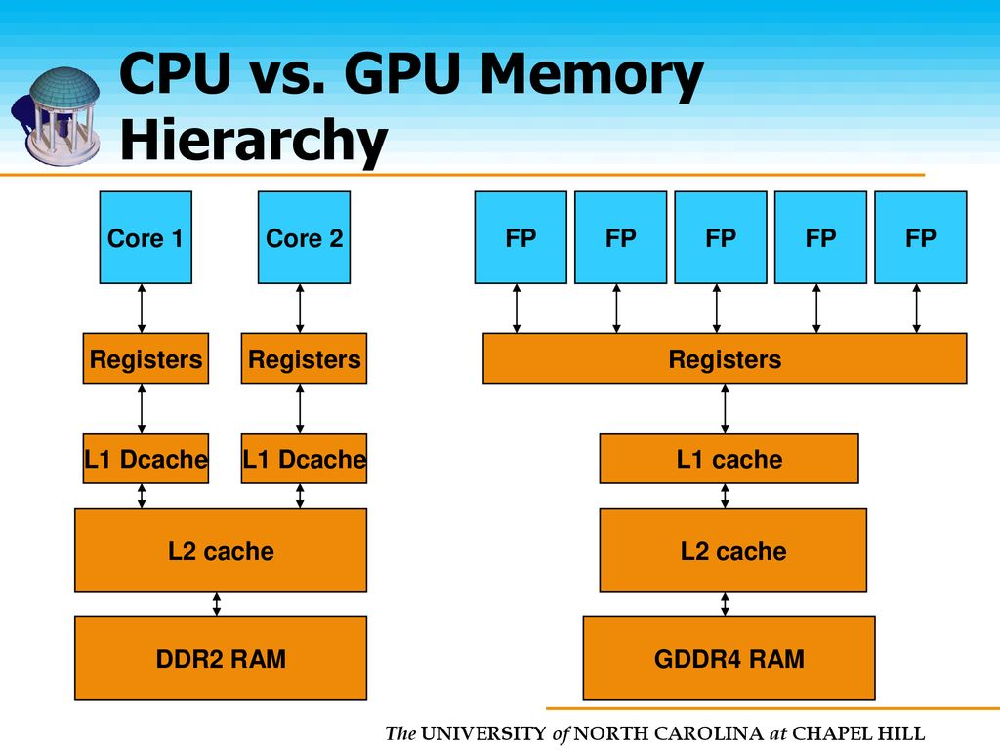
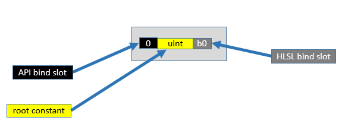
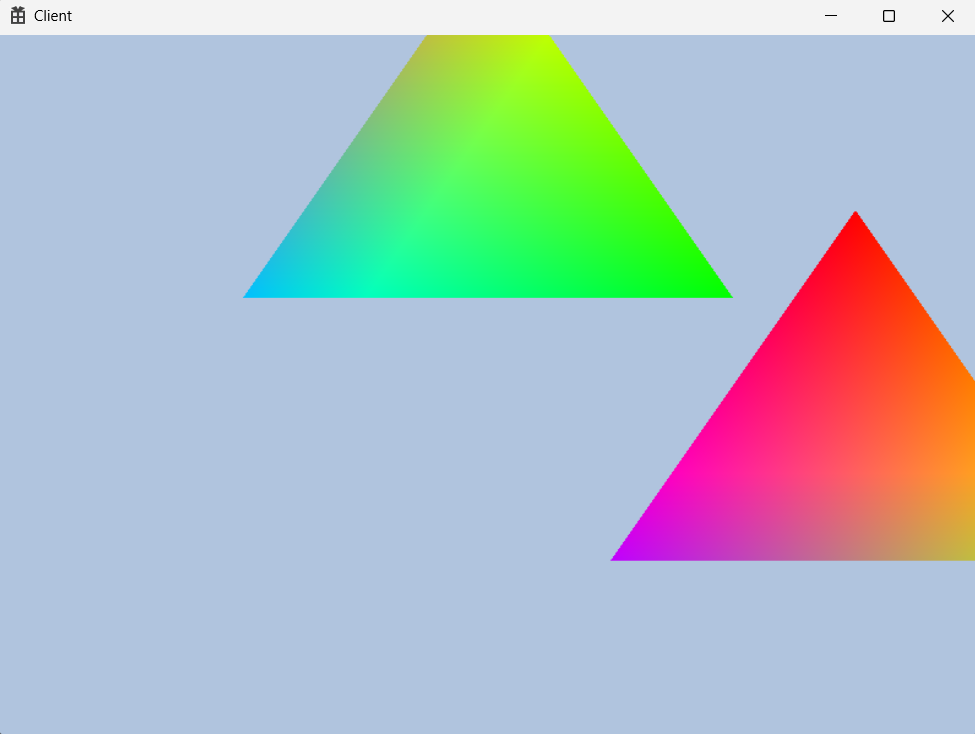
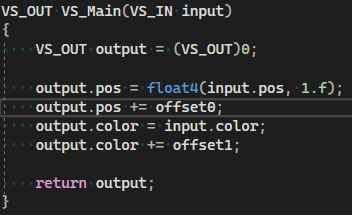

<br>

### 🚀 CPU VS GPU



아래 계층으로 갈수로 용량은 많지만 속도가 느리다.

우리가 만든 `DirectX`에 `DDR2 RAM`에서 `GDDR4 RAM`으로 가는 것은 즉시 일어나지만 (`Map Unmap`)

`GDDR4 RAM`에서 `Registers`로 올라가는 것은 시간이 걸린다. (커맨드 패턴)

---

### 🚀 RootSignature

- `RootSignature`에 대한 자세한 설명 (`msdn`)
    
    [https://learn.microsoft.com/ko-kr/windows/win32/direct3d12/example-root-signatures#an-empty-root-signature](https://learn.microsoft.com/ko-kr/windows/win32/direct3d12/example-root-signatures#an-empty-root-signature)
    
    msdn 공식 문서이며 단일 상수, 루트 상수 버퍼 뷰 추가, 루트 테이블 등등의 설명이 들어감
    

`RootSignature`는 `GPU`의 레지스터 단계를 어떻게 사용할 것인지 서명하는 것



`API bind slot`은 진짜 번호표와 같고 인덱스랑 비슷하다 보면 됨.

`root constant`는 이놈이 무슨 놈인지 타입 정하는거라고 보면 됨.

`HLSL bind slot`은 어떤 레지스터를 사용할 것인지 정하는 것.

- `constant buffer` : b로 시작
- `srv` : t로 시작
- `unordered access` : u로 시작

`**ConstantBuffer`를 사용하기 위해서**

```cpp
cbuffer TEST_B0 :register(b0)
{
    float4 offset0;
}

cbuffer TEST_B1 : register(b1)
{
    float4 offset1;
}
```

`hlsl`파일에 상수버퍼용 `offset`을 만들고 `output.pos += offset0;` 이렇게 사용할 것이다.

그렇게 하기 위해서 일단 `RootSignature`에서 서명을 해야하는데

```cpp
CD3DX12_ROOT_PARAMETER param[2];
param[0].InitAsConstantBufferView(0);
param[1].InitAsConstantBufferView(1);

// 텅 빈 상태의 RootSignature 생성
//D3D12_ROOT_SIGNATURE_DESC sigDesc = CD3DX12_ROOT_SIGNATURE_DESC(D3D12_DEFAULT);
D3D12_ROOT_SIGNATURE_DESC sigDesc = CD3DX12_ROOT_SIGNATURE_DESC(2, param);
```

`CD3DX12_ROOT_PARAMETER param[2];` 로 파라미터를 생성하였는데 각 파라미터에는 `InitAsConstantBufferView` 를 호출 함으로써 `ConstantBufferView`를 만들었다.

그리고 `sigDesc`는 `DEFAULT`에서 `param`을 참조하도록 바뀌었다.

자리 서명의 세팅은 끝이 났으니 `RenderBegin`에서 진짜 서명을 해야한다.

```cpp
// 자리 임대 서명
_cmdList->SetGraphicsRootSignature(ROOT_SIGNATURE.Get());
```

`_cmdList->ResourceBarrier(1, &barrier);` 전에 위치해있으며 `msdn`에 따르면 `SetGraphicsRootSignature` 은 상수 버퍼 뷰 추가 함수라고 한다.

여기까지 했으면 `Mesh`의 `Render`에서 진짜 일감들을 알려줘야하는데

1. `Buffer`에다가 데이터 세팅
2. `Buffer`의 주소를 `register`에다가 전송

의 순서를 지키면서

`CMD_LIST->SetGraphicsRootConstantBufferView(0, ??);` 을 호출해야한다.

여기서 ??는 상수버퍼의 주소를 말한다.

이때 `CPU VS GPU`에서의 사진이 중요한데 우리는 커맨드 패턴을 사용하는 `DirectX12`버전이다.

그렇기에 `CPU`에서 `GPU`의 가장 아랫계층에 정보를 넘기는 것은 `Device`를 통해서 진행되기 때문에 즉시 일어나지만 아랫계층에서 `register`로 올라가는 것은 커맨드 패턴으로 시간이 걸린다.

이 때문에 버퍼에는 상수버퍼 0번을 보낸뒤 곧 바로 0번자리에 1번 데이터를 덮어쓰게 되는 문제가 생긴다.

이 문제를 해결하기 위해서 할 수 있는 유일한 방법은 버퍼를 여러개 생성하는 것이다.

그래서 우리는 `ConstantBuffer Class`를 새로 만드는 방법을 사용할 것이다.

---

### 🚀 ConstantBuffer Class

```cpp
#pragma once

class ConstantBuffer
{
public:
	ConstantBuffer();
	~ConstantBuffer();

	void Init(uint32 size, uint32 count);

	void Clear();
	void PushData(int32 rootParamIndex, void* buffer, uint32 size);

	D3D12_GPU_VIRTUAL_ADDRESS GetGpuVirtualAddress(uint32 index);

private:
	void CreateBuffer();

private:
	ComPtr<ID3D12Resource>	_cbvBuffer;
	BYTE*					          _mappedBuffer = nullptr;
	uint32					        _elementSize = 0;
	uint32					        _elementCount = 0;

	uint32					        _currentIndex = 0;
};
```

`BYTE`는 `typedef unsigned char`으로 정의 되어있다.

상수버퍼는 `ComPtr<ID3D12Resource> _cbvBuffer;` 이 부분이 핵심으로 버퍼를 채워서 용도에 맞게 설정하면 될 것이다.

코드 분석을 하면서 왜 인자들이 필요한지 확인해보자.

```cpp
#include "pch.h"
#include "ConstantBuffer.h"
#include "Engine.h"

ConstantBuffer::ConstantBuffer()
{
}

ConstantBuffer::~ConstantBuffer()
{
	if (_cbvBuffer)
	{
		if (_cbvBuffer != nullptr)
			_cbvBuffer->Unmap(0, nullptr);

		_cbvBuffer = nullptr;
	}
}

void ConstantBuffer::Init(uint32 size, uint32 count)
{
	// 상수 버퍼는 256 바이트 배수로 만들어야 한다
	// 0 256 512 768
	_elementSize = (size + 255) & ~255;
	_elementCount = count;

	CreateBuffer();
}

void ConstantBuffer::CreateBuffer()
{
	uint32 bufferSize = _elementSize * _elementCount;
	D3D12_HEAP_PROPERTIES heapProperty = CD3DX12_HEAP_PROPERTIES(D3D12_HEAP_TYPE_UPLOAD);
	D3D12_RESOURCE_DESC desc = CD3DX12_RESOURCE_DESC::Buffer(bufferSize);

	DEVICE->CreateCommittedResource(
		&heapProperty,
		D3D12_HEAP_FLAG_NONE,
		&desc,
		D3D12_RESOURCE_STATE_GENERIC_READ,
		nullptr,
		IID_PPV_ARGS(&_cbvBuffer));

	_cbvBuffer->Map(0, nullptr, reinterpret_cast<void**>(&_mappedBuffer));
}

void ConstantBuffer::Clear()
{
	_currentIndex = 0;
}

void ConstantBuffer::PushData(int32 rootParamIndex, void* buffer, uint32 size)
{
	assert(_currentIndex < _elementCount); // 디버그 용

	::memcpy(&_mappedBuffer[_currentIndex * _elementSize], buffer, size);

	D3D12_GPU_VIRTUAL_ADDRESS address = GetGpuVirtualAddress(_currentIndex);
	CMD_LIST->SetGraphicsRootConstantBufferView(rootParamIndex, address);
	_currentIndex++;
}

D3D12_GPU_VIRTUAL_ADDRESS ConstantBuffer::GetGpuVirtualAddress(uint32 index)
{
	D3D12_GPU_VIRTUAL_ADDRESS objCBAddress = _cbvBuffer->GetGPUVirtualAddress();
	objCBAddress += index * _elementSize;
	return objCBAddress;
}
```

생성자 소멸자 부분은 딱히 분석이 필요없으니 넘어가고 `Init`함수를 보면 `elementCount`와 `elementSize`를 받는다. 상수버퍼는 `DirectX`의 요구에 따라 `256byte` 배수로 만로 `_elementSize = (size + 255) & ~255;` 이란 코드가 들어갔다.

그 후 `CreateBuffer`함수로 버퍼를 생성한다.

- `**_elementSize = (size + 255) & ~255;` 해석하기**
    
    여기서 헷갈리만한 것은 아마 ~255이라고 생각한다. ~표시는 NOT연산자로 255비트를 뒤집는다. 0은 1로 1은 0으로 바꾸는 것이다. 그렇게 하면 WORD 기준으로 아래와 같다.
    
    
    
    `1111 1111 0000 0000` 과 `&`를 하면 무조건 256의 배수가 되는 것이다.
    
    그러면 `size * ~255`를 하면 되는거 아냐? 라고 물을 수 있다.
    
    `(size + 255)`를 해준 이유는 버퍼는 일단 용량이 작으면 안되니까 만약 256보다 작으면 `_elementSize`가 0이 되니까 최소한은 256만큼은 더해 줘야 한다.
    
    256만큼 더해야하는거 아냐? 라고 생각 할 수 있다. 255 만큼 더하는 것은 256을 더해버리면 `size`가 1이거나 256의 배수일 때 불필요하게 용량이 커지게된다.
    

**`CreateBuffer`함수 분석**

`uint32 bufferSize = _elementSize * _elementCount;` 으로 `size * count`로 버퍼 크기를 스택메모리에 저장했다.  그 뒤 `D3D12_HEAP_PROPE` 와 `D3D12_RESOURCE_DESC` 은 `CreateCommittedResource`을 하기위한 선행 작업이다. `CreateCommittedResource` 을 했으므로 리소스를 `_cbvBuffer`에 채웠다.

그리고 `_cbvBuffer->Map(0, nullptr, reinterpret_cast<void**>(&_mappedBuffer));` 을 하면서 뒤에 추가 적인 정보를 받도록 일감 뚜껑을 열어주고 있다.

`**Clear**` 는 `_currentIndex` 를 0으로 밀어버려서 다음에 버퍼에 정보를 넣을 때 0번부터 다시 시작하게 한다. 마치 `vector`의 `clear`랑 비슷한 느낌으로 정보를 다 날리는 것이 아니다.

`**PushData` 함수 분석**

`assert(_currentIndex < _elementCount);` 은 디버그 용도로 현재 인덱스가 총 요소 개수보다 작아야 되니까 적어준 것.

`::memcpy(&_mappedBuffer[_currentIndex * _elementSize], buffer, size);` 은 어느 위치에 무엇을 얼마만큼 복사 할 것인지 `memcpy`로 버퍼에 복사하는 함수.

`D3D12_GPU_VIRTUAL_ADDRESS address = GetGpuVirtualAddress(_currentIndex);` 로 버퍼의 주소값을 가져왔다. 왜냐하면 `SetGraphicsRootConstantBufferView` 를 사용하여 버퍼 뷰를 추가하기 위해서 버퍼의 주소값이 필요하기 때문이다.

그 인덱스 값을 늘려서 다음에 받을 데이터는 다음칸에 넣을 거다라고 정한다.

`ConstantBuffer`의 구성은 완료 했으니 `Engine`에서 멤버변수로 등록과 생성을 해주고 `Init`까지 해준다.

이렇게하면 `ConstantBuffer`는 만들어졌으니 `CommandQueue`에 `RenderBegin`으로 가서 `RootSignature`서명이 끝난 뒤 `ConstantBuffer`를 `Clear`해준다.

---

### 🚀 ConstantBuffer 사용하기

사용하기 위해서 `Mesh`에서 `Transform _transform = {};` 을 멤버 변수로 들고 있게 한다. `Transform`은 새로 정한 구조체로 `Vec4`만 들고있는 구조체이다. `void SetTransform(const Transform& t) { _transform = t; }` 을 만들어서 `Set`함수도 만들었다.`

이렇게 한 뒤 `Mesh`의 `Render`로 들어가서 `GEngine->GetCB()->PushData(0, &_transform, sizeof(_transform));` 와 `GEngine->GetCB()->PushData(1, &_transform, sizeof(_transform));` 을 넣는다.

첫 번째는 0번 인덱스에 `_transform`을 그 크기만큼 `PushData` 하고 두 번째는 1번 인덱스에 `PushData`를 한다는 뜻이다.

모든 준비가 끝났으니 `Game.cpp`로 돌아가서 `Update`함수를 아래와 같이 고친다.

```cpp
void Game::Update()
{
	GEngine->RenderBegin();

	shader->Update();

	{
		Transform t;
		t.offset = Vec4(0.75f, 0.f, 0.f, 0.f);
		mesh->SetTransform(t);

		mesh->Render();
	}

	{
		Transform t;
		t.offset = Vec4(0.f, 0.75f, 0.f, 0.f);
		mesh->SetTransform(t);

		mesh->Render();
	}

	GEngine->RenderEnd();
}
```

여기서 보면 `shader`의 `update`이후에 `Transform`을 생성함과 동시에 `mesh→Render();`를 해주는데 그 작업을 두 번 하니까 총 두 개의 삼각형이 나오게 될 것이다.

---

### 🚀 결과



`t.offset = Vec4(0.75f, 0.f, 0.f, 0.f);` 을 한 삼각형은 오른쪽으로 이동하면서 `R`값이 증가해 빨간색이 강해졌다.

`t.offset = Vec4(0.f, 0.75f, 0.f, 0.f);` 을 한 삼각형은 위쪽으로 이동하면서 `G`값이 증가해서 녹색이 강해졌다.

이동과 색이 둘 다 한 벡터로 인해 바뀌었는데 그 이유는 `hlsl`에서 우리가 바꿨기 때문이다.



여기서 `offet0`은 위치값을 `offset1`은 색을 담당하는데 우리는 `mesh`에서 `render`를 할 때 둘 다 `transform`을 참조하도록 했으니 같은 아이를 참조하므로 결과적으로 `Vec4` 하나가 `pos, color`를 바꾸게 됐다.