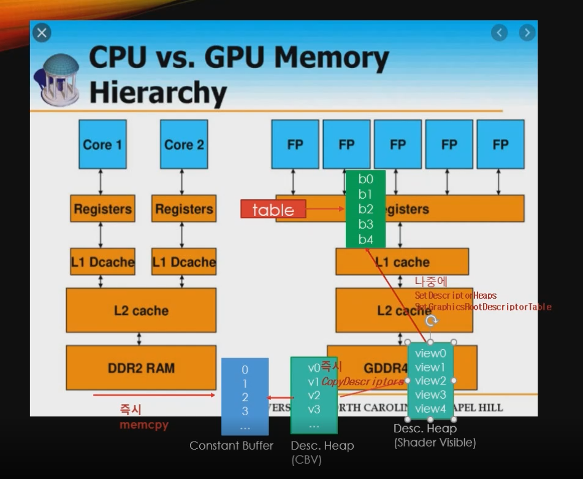
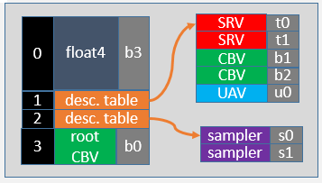

<br>

### 🚀 대략적인 그림

**RootSignature MSDN 문서**

[루트 서명 예제 - Win32 apps](https://learn.microsoft.com/ko-kr/windows/win32/direct3d12/example-root-signatures)





 

**Constant Buffer View**에서 ****Binding descriptor table****

- 해야할 것
    1. RootSignature를 constant buffer에서 table형식으로 바꾸기
    2. Desc.Heap(CBV) 생성
    3. TableDescriptorHeap Class 생성 후 Desc.Heap(Shader Visible) 생성 및 Desc.Heap(CBV) 내용 복사
    4. Desc.Heap(Shader Visible)에서 Register로 올리기
    5. 실질적 사용을 위한 사용 변경

RootSignature 사용 방법을 RootTable로 사용해보기

constant buffer view를 사용하고 있었지만 root table로 사용 할 수 있다.

cpu ram에서 gpu ram으로 이동은 즉시 일어나고gpu ram에서 gpu register으로 이동은 커맨드 패턴에의해 늦게 일어난다.

이번에 즉시 일어나는 부분은 ConstantBuffer->Desc.Heap(CBV)->Desc.Heap(Shader Visible)이며Desc.Heap(CBV)->Desc.Heap(Shader Visible)은 `CopyDescriptors`을 사용한다.

나중에 일어나는 부분은 Desc.Heap(Shader Visible)에서 register로 가는 부분이며 `SetDescriptorHeaps`으로 큰 영역을 한 번 설정하고 `SetGraphicsRootDescriptorTable`로 세부 영역을 설정한다.

`SetDescriptorHeaps`는 어마어마하게 느리기때문에 딱 한번만 사용해야 한다. 그리고 desc를 작성할 때 커맨드용도로 제출하는 상황이라면 Flag를 무조건 D3D12_DESCRIPTOR_HEAP_FLAG_SHADER_VISIBLE로 설정해야 한다.

---

### 🚀 RootSignature 변경

```cpp
void RootSignature::Init(ComPtr<ID3D12Device> device)
{
	CD3DX12_DESCRIPTOR_RANGE ranges[] =
	{
		CD3DX12_DESCRIPTOR_RANGE(D3D12_DESCRIPTOR_RANGE_TYPE_CBV, CBV_REGISTER_COUNT, 0), // b0~b4
	};

	CD3DX12_ROOT_PARAMETER param[1];
	param[0].InitAsDescriptorTable(_countof(ranges), ranges);

	D3D12_ROOT_SIGNATURE_DESC sigDesc = CD3DX12_ROOT_SIGNATURE_DESC(_countof(param), param);
	sigDesc.Flags = D3D12_ROOT_SIGNATURE_FLAG_ALLOW_INPUT_ASSEMBLER_INPUT_LAYOUT; // 입력 조립기 단계

	ComPtr<ID3DBlob> blobSignature;
	ComPtr<ID3DBlob> blobError;
	::D3D12SerializeRootSignature(&sigDesc, D3D_ROOT_SIGNATURE_VERSION_1, &blobSignature, &blobError);
	device->CreateRootSignature(0, blobSignature->GetBufferPointer(), blobSignature->GetBufferSize(), IID_PPV_ARGS(&_signature));
}
```

`InitAsConstantBufferView` 로 버퍼를 만들었는데 테이블을 사용할 것 이므로 RootSignature::Init에서 CD3DX12_ROOT_PARAMETER param[2]; 의 param[0]을 `InitAsDescriptorTable()`로 만들어준다.

`InitAsDescriptorTable`은 인자로 Range를 받는데 테이블 속 인자들이 어떻게 구성되어 있는지 설명하는 용도이다.CD3DX12_DESCRIPTOR_RANGE는 type, count, index를 받는다.이 때 index는 몇번부터 사용할 것인지 말하는 것이고 우리 경우 0을 넣으면 b0부터 사용한다는 뜻.

---

### 🚀 Desc.Heap(CBV) 생성

```cpp
#pragma once

class ConstantBuffer
{
public:
	ConstantBuffer();
	~ConstantBuffer();

	void Init(uint32 size, uint32 count);

	void Clear();
	D3D12_CPU_DESCRIPTOR_HANDLE PushData(int32 rootParamIndex, void* buffer, uint32 size);

	D3D12_GPU_VIRTUAL_ADDRESS GetGpuVirtualAddress(uint32 index);
	D3D12_CPU_DESCRIPTOR_HANDLE GetCpuHandle(int32 index);

private:
	void CreateBuffer();
	void CreateView();

private:
	ComPtr<ID3D12Resource>			_cbvBuffer;
	BYTE*							_mappedBuffer = nullptr;
	uint32							_elementSize = 0;
	uint32							_elementCount = 0;

	ComPtr<ID3D12DescriptorHeap>	_cbvHeap; // new!!
	D3D12_CPU_DESCRIPTOR_HANDLE		_cpuHandleBegin = {}; // new!!
	uint32							_handleIncrementSize = 0; // new!!

	uint32							_currentIndex = 0;
};
```

Desc.Heap(CBV) 생성

ConstantBuffer에서 ComPtr<ID3D12DescriptorHeap>, D3D12_CPU_DESCRIPTOR_HANDLE, uint32 인자를 추가하고 각각 _cbvHeap, _cputHandleBegin, _handleIncrementSize로 칭한다_cbvHeap은 Desc.Heap(CBV)를 말하는 것이고 _cpuHandleBegin은 시작핸들주소를 가져오고 _handleIncrementSize는 시작핸들에서 몇 번째인지 알려줄 것이다.

```cpp
void ConstantBuffer::CreateView()
{
	D3D12_DESCRIPTOR_HEAP_DESC cbvDesc = {};
	cbvDesc.NumDescriptors = _elementCount;
	cbvDesc.Flags = D3D12_DESCRIPTOR_HEAP_FLAG_NONE;
	cbvDesc.Type = D3D12_DESCRIPTOR_HEAP_TYPE_CBV_SRV_UAV;
	DEVICE->CreateDescriptorHeap(&cbvDesc, IID_PPV_ARGS(&_cbvHeap));

	_cpuHandleBegin = _cbvHeap->GetCPUDescriptorHandleForHeapStart();
	_handleIncrementSize = DEVICE->GetDescriptorHandleIncrementSize(D3D12_DESCRIPTOR_HEAP_TYPE_CBV_SRV_UAV);

	for (uint32 i = 0; i < _elementSize; ++i)
	{
		D3D12_CPU_DESCRIPTOR_HANDLE cbvHandle = GetCpuHandle(i);

		D3D12_CONSTANT_BUFFER_VIEW_DESC cbvDesc = {};
		cbvDesc.BufferLocation = _cbvBuffer->GetGPUVirtualAddress() + static_cast<uint64>(_elementSize) * i;
		cbvDesc.SizeInBytes = _elementSize;

		DEVICE->CreateConstantBufferView(&cbvDesc, cbvHandle);
	}
}
```

ConstantBuffer::Init에서 CreateBuffer()뒤 CreateView()함수를 추가한다.

CreateView()는 이번에 새로 만드는 함수로D3D12_DESCRIPTOR_HEAP_DESC를 구성한 후에 CreateDescriptorHeap를 만들어주고 `_cpuHeap`를 구성했으니 `_cpuHandleBegin`과 `_handleIncrementSize`를 뽑을 수 있는데 각각 `_cpuHeap->GetCPUDescriptorHandleForHeapStart();` 

`DEVICE->GetDescriptorHandleIncrementSize(D3D12_DESCRIPTOR_HEAP_TYPE_CBV_SRV_UAV);` 로 설정해준다. 

이 때 `_handleIncrementSize`는 꼭 저 함수를 사용해야하는데 MSDN문서를 보면 각 컴퓨터마다 CPU 사양이 다르기때문이라고 한다.

그 후 for문을 사용해 `_elementSize`만큼 순회를 하면서 `GetCpuHandle()`로 Handle를 뽑아오고 D3D12_CONSTNATBUFFER_VIEW_DESC를 생성해 버퍼의 위치, 크기값을 설정하고 `DEVICE->CreateConstantBufferView(&cbvDesc, cbvHandle);` 로 view를 생성한다.

---

### 🚀 Desc.Heap(Shader Visible)

```cpp
#pragma once

class TableDescriptorHeap
{
public:
	void Init(uint32 count);

	void Clear();
	void SetCBV(D3D12_CPU_DESCRIPTOR_HANDLE srcHandle, CBV_REGISTER reg);
	void CommitTable();

	ComPtr<ID3D12DescriptorHeap> GetDescriptorHeap() { return _descHeap; }

	D3D12_CPU_DESCRIPTOR_HANDLE GetCPUHandle(CBV_REGISTER reg);

private:
	D3D12_CPU_DESCRIPTOR_HANDLE GetCPUHandle(uint32 reg);

private:

	ComPtr<ID3D12DescriptorHeap>	_descHeap;
	uint64							_handleSize = 0;
	uint64							_groupSize = 0;
	uint64							_groupCount = 0;

	uint32							_currentGroupIndex = 0;
};
```

```cpp
void TableDescriptorHeap::Init(uint32 count)
{
	_groupCount = count;

	D3D12_DESCRIPTOR_HEAP_DESC desc = {};
	desc.NumDescriptors = count * REGISTER_COUNT;
	desc.Flags = D3D12_DESCRIPTOR_HEAP_FLAG_SHADER_VISIBLE;
	desc.Type = D3D12_DESCRIPTOR_HEAP_TYPE_CBV_SRV_UAV;

	DEVICE->CreateDescriptorHeap(&desc, IID_PPV_ARGS(&_descHeap));

	_handleSize = DEVICE->GetDescriptorHandleIncrementSize(D3D12_DESCRIPTOR_HEAP_TYPE_CBV_SRV_UAV);
	_groupSize = _handleSize * REGISTER_COUNT;
}
```

TableDescriptorHeap

TableDescriptorHeap::Init은 uint32로 count를 인자로 받고 이 인자는 `_groupCount`를 의미하므로 대입한다.그리고 `D3D12_DESCRIPTOR_HEAP_DESC`를 만들어주는데 이때는 꼭 Flags를 D3D12_DESCRIPTOR_HEAP_FLAG_SHADER_VISIBLE로 만들어주어야한다. 이렇게 해야 GPU에 상주 할 수 있고 renderingPipeline에 따라 일이 진행되는데 어디서는 뽑아 쓸 수 있게 된다.모든 작업이 끝났으면 DEVICE로 CreateDescriptorHeap를 해준다.`_handleSize` 는 DEVICE로 GetDescriptorHandleIncrementSize로 받아오고 `_groupSize` 는 `_handleSize` 에서 REGISTER_COUNT의 곱으로 이룬다.

```cpp
void TableDescriptorHeap::Clear()
{
	_currentGroupIndex = 0;
}
```

Clear함수는 현재 인덱스인 `_currentGroupIndex`를 0으로 미는 함수이다.

```cpp
void TableDescriptorHeap::SetCBV(D3D12_CPU_DESCRIPTOR_HANDLE srcHandle, CBV_REGISTER reg)
{
	D3D12_CPU_DESCRIPTOR_HANDLE destHandle = GetCPUHandle(reg);

	uint32 destRange = 1;
	uint32 srcRange = 1;
	DEVICE->CopyDescriptors(1, &destHandle, &destRange, 1, &srcHandle, &srcRange, D3D12_DESCRIPTOR_HEAP_TYPE_CBV_SRV_UAV);
}
```

TableDescriptorHeap::SetCBV에서는 srcHandle과 register를 인자로 받는데 하는 역할은 Desc.Heap(CBV)에서 Desc.Heap(Shader Visible)로 복사해준다.destHandle를 GetCPUHandle로 만들고 srcHandle, destHandle 모두 range는 1로 CopyDescriptors를 실행한다.

```cpp
D3D12_CPU_DESCRIPTOR_HANDLE TableDescriptorHeap::GetCPUHandle(CBV_REGISTER reg)
{
	return GetCPUHandle(static_cast<uint32>(reg));
}

D3D12_CPU_DESCRIPTOR_HANDLE TableDescriptorHeap::GetCPUHandle(uint32 reg)
{
	D3D12_CPU_DESCRIPTOR_HANDLE handle = _descHeap->GetCPUDescriptorHandleForHeapStart();
	handle.ptr += _currentGroupIndex * _groupSize;
	handle.ptr += reg * _handleSize;
	return handle;
}
```

TableDescriptorHeap::GetCPUHandle은 GetCPUDescriptorHandleForHeapStart로 시작핸들을 가져오고 여기서 handle.ptr에 `_currentGroupIndex * _groupSize;` 만큼 더해준다. 그 후 `reg * _handleSIze;` 만큼 또 더해준다. 마치 몇 동 몇 호를 설명하는 것 처럼 큼직하게 이동한 후 세세한 위치를 설정

```cpp
void TableDescriptorHeap::CommitTable()
{
	D3D12_GPU_DESCRIPTOR_HANDLE handle = _descHeap->GetGPUDescriptorHandleForHeapStart();
	handle.ptr += _currentGroupIndex * _groupSize;
	CMD_LIST->SetGraphicsRootDescriptorTable(0, handle);

	_currentGroupIndex++;
}
```

TableDescriptorHeap::CommitTable에서는 Desc.Heap(Shader Visible)에서 register단계로 올려보내는 함수이다.현재 인덱스에 있는 handle을 가져오고 `SetGraphicsRootDescriptorTable(0, handle)`로 레지스터로 올려보낸 후 `_currentGroupIndex++;` 로 인덱스롤 올린다.

---

### 🚀 Register로 올리기 및 사용을 위한 세팅

```cpp
void CommandQueue::RenderBegin(const D3D12_VIEWPORT* vp, const D3D12_RECT* rect)
{
	_cmdAlloc->Reset();
	_cmdList->Reset(_cmdAlloc.Get(), nullptr);

	D3D12_RESOURCE_BARRIER barrier = CD3DX12_RESOURCE_BARRIER::Transition(
		_swapChain->GetCurrentBackBufferResource().Get(),
		D3D12_RESOURCE_STATE_PRESENT, // 화면 출력
		D3D12_RESOURCE_STATE_RENDER_TARGET); // 외주 결과물

	// 자리 임대 서명
	_cmdList->SetGraphicsRootSignature(ROOT_SIGNATURE.Get());
	GEngine->GetCB()->Clear();
	GEngine->GetTableDescHeap()->Clear(); // new!!

	ID3D12DescriptorHeap* descHeap = GEngine->GetTableDescHeap()->GetDescriptorHeap().Get(); // new!!
	_cmdList->SetDescriptorHeaps(1, &descHeap); // new!!

	_cmdList->ResourceBarrier(1, &barrier);

	// Set the viewport and scissor rect.  This needs to be reset whenever the command list is reset.
	_cmdList->RSSetViewports(1, vp);
	_cmdList->RSSetScissorRects(1, rect);

	// Specify the buffers we are going to render to.
	D3D12_CPU_DESCRIPTOR_HANDLE backBufferView = _swapChain->GetBackRTV();
	_cmdList->ClearRenderTargetView(backBufferView, Colors::LightSteelBlue, 0, nullptr);
	_cmdList->OMSetRenderTargets(1, &backBufferView, FALSE, nullptr);
}
```

`SetGraphicDescriptors` 는 매우 느린 함수여서 매 프레임당 한 번씩 사용해야 한다. RenderBegin에서 cb의 Clear후 tableDescHeap역시 clear를 해준다. 그 뒤 `ID3D12DescriptorHeap* descHeap = GEngine->GetTableDescHeap()->GetDescriptorHeap().Get();` `_cmdList->SetDescriptorHeaps(1, &descHeap);`를 한다.

```cpp
D3D12_CPU_DESCRIPTOR_HANDLE ConstantBuffer::PushData(int32 rootParamIndex, void* buffer, uint32 size)
{
	assert(_currentIndex < _elementCount); //

	::memcpy(&_mappedBuffer[_currentIndex * _elementSize], buffer, size);

	D3D12_CPU_DESCRIPTOR_HANDLE cpuHandle = GetCpuHandle(_currentIndex); // new!!

	_currentIndex++;

	return cpuHandle; // new!!

}
```

mesh의 `pushData`를 보면 `SetGraphicsRootConstantBufferView` 로 주소값을 전달하는데 우리는 rootSignature를 바꾸는 과정에서 rootParamIndex를 제거 했으므로 return 값으로 보내는 방식으로 전환한다. 

```cpp
void Mesh::Render()
{
	CMD_LIST->IASetPrimitiveTopology(D3D_PRIMITIVE_TOPOLOGY_TRIANGLELIST);
	CMD_LIST->IASetVertexBuffers(0, 1, &_vertexBufferView);

	// TODO 진짜 그릴 애들 설정
	// 1. Buffer에다가 데이터 세팅
	// 2. TableDescHeap에다가 CBV 전달
	// 3. 모든 세팅이 끝났으면 TableDescHeap 커밋
	{
		D3D12_CPU_DESCRIPTOR_HANDLE handle = GEngine->GetCB()->PushData(0, &_transform, sizeof(_transform));
		GEngine->GetTableDescHeap()->SetCBV(handle, CBV_REGISTER::b0);
	}

	{
		D3D12_CPU_DESCRIPTOR_HANDLE handle = GEngine->GetCB()->PushData(0, &_transform, sizeof(_transform));
		GEngine->GetTableDescHeap()->SetCBV(handle, CBV_REGISTER::b1);
	}

	GEngine->GetTableDescHeap()->CommitTable();

	CMD_LIST->DrawInstanced(_vertexCount, 1, 0, 0);
}
```

GetCpuHandle로 현재 인덱스를 인자로 넣고 리턴.이렇게 바꿨으면 Mesh::Render에서 handle값을 받아와서 tableDescHeap에 `SetCBV`로 전달한다.전달을 하고 `CommitTable`을 해주면 끝!

---

### 🚀 결과 화면


당연히 결과는 바뀐것은 없다. 그저 ConstantBufferView에서 RootTable을 사용하는 방식으로 바뀐 것 뿐!