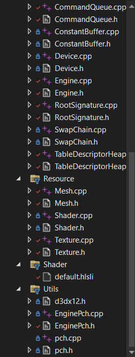
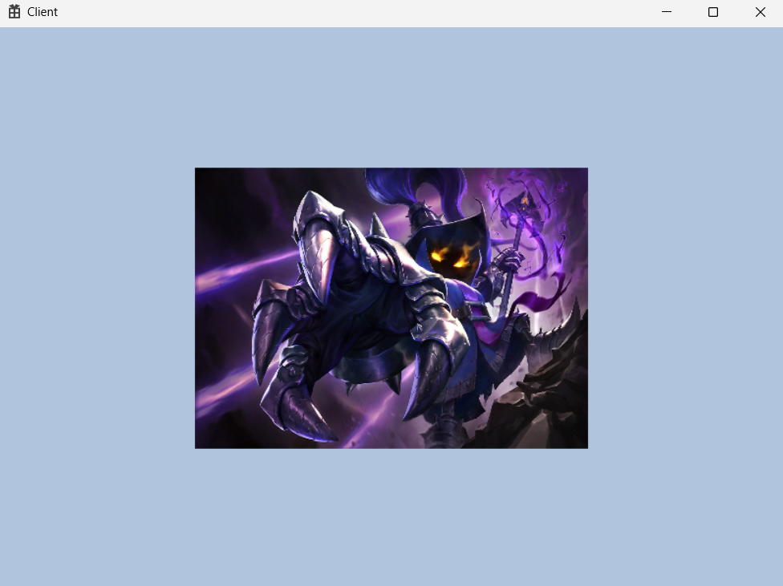
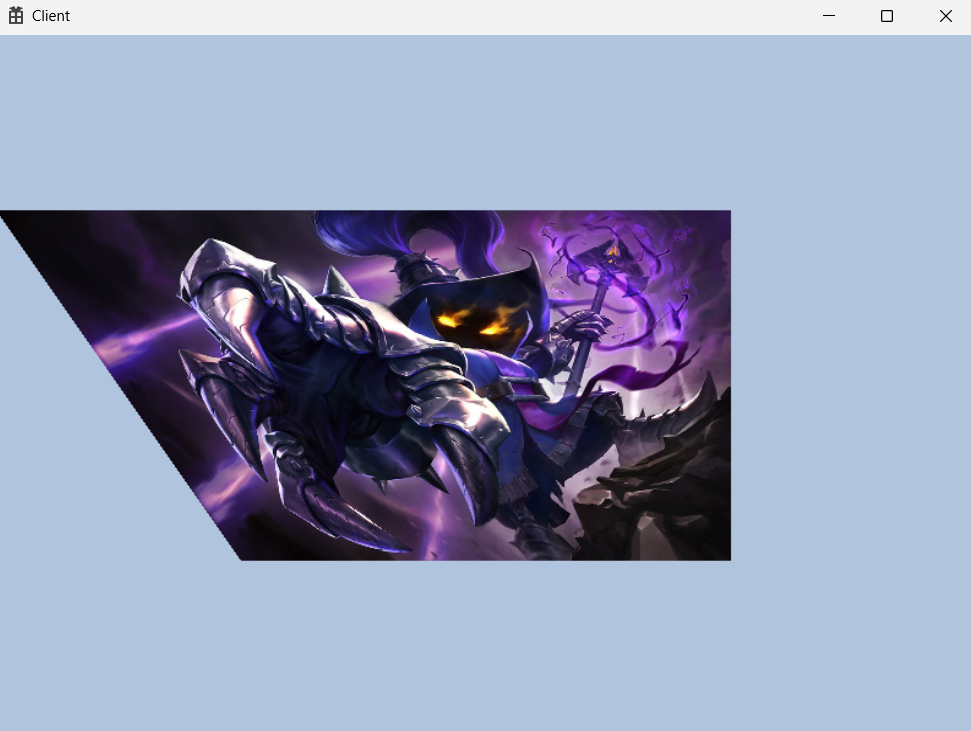

<br>

### 🚀 무엇을 할 것인가?

전 시간에서 만든 사각형의 vertex에 uv좌표를 넣어서 사진을 삽입 할 것이다.

아 진짜 너무 어려운데 못해먹겠는데 아

아ㅏㅇ

아ㅏ앙

ㅏ아아아아아아ㅏ아아아아 머리가 터질거같은데 모르겠는데..! 



```cpp
#include <DirectXTex/DirectXTex.h>
#include <DirectXTex/DirectXTex.inl>

#ifdef _DEBUG
#pragma comment(lib, "DirectXTex\\DirectXTex_debug.lib")
#else
#pragma comment(lib, "DirectXTex\\DirectXTex.lib")
#endif
```

엔진의 대부분이 변경 되었다. Resource산하의 Texture class가 추가 되었고, 마소의 공식 데이터인 `DirecteXTex.h` `DirecteXTex.inl` `DirecteXTex.lib` 을 다운 받고 솔루션 파일에서 Library폴더를 만들어서 관리하게 된다.

헤더파일 : Library\Include
lib파일 : Library\Lib

```cpp
#include <filesystem>
namespace fs = std::filesystem;
```

파일을 관리하기 위한 헤더파일이 C++17 부터 추가 되었기 때문에 언어를 17로 맞춘 후 `EnginePch.h` 에 filesystem을 추가한다. filesystem의 byte와 std의 byte가 충돌 하기 때문에 `#define _HAS_STD_BYTE NULL` 을 추가 해야한다.

---

### 🚀 Texture

```cpp
#pragma once

class Texture
{
public:
	void Init(const wstring& path);

	D3D12_CPU_DESCRIPTOR_HANDLE GetCpuHandle() { return _srvHandle; }

public:
	void CreateTexture(const wstring& path);
	void CreateView();

private:
	ScratchImage			 		_image;
	ComPtr<ID3D12Resource>			_tex2D;

	ComPtr<ID3D12DescriptorHeap>	_srvHeap;
	D3D12_CPU_DESCRIPTOR_HANDLE		_srvHandle;
};
```

```cpp
void Texture::CreateTexture(const wstring& path)
{
	// 파일 확장자 얻기
	wstring ext = fs::path(path).extension();

	if (ext == L".dds" || ext == L".DDS")
		::LoadFromDDSFile(path.c_str(), DDS_FLAGS_NONE, nullptr, _image);
	else if (ext == L".tga" || ext == L".TGA")
		::LoadFromTGAFile(path.c_str(), nullptr, _image);
	else // png, jpg, jpeg, bmp
		::LoadFromWICFile(path.c_str(), WIC_FLAGS_NONE, nullptr, _image);

	HRESULT hr = ::CreateTexture(DEVICE.Get(), _image.GetMetadata(), &_tex2D);
	assert(SUCCEEDED(hr));

	vector<D3D12_SUBRESOURCE_DATA> subResources;

	hr = ::PrepareUpload(DEVICE.Get(),
		_image.GetImages(),
		_image.GetImageCount(),
		_image.GetMetadata(),
		subResources);

	assert(SUCCEEDED(hr));

	const uint64 bufferSize = ::GetRequiredIntermediateSize(_tex2D.Get(), 0, static_cast<uint32>(subResources.size()));

	D3D12_HEAP_PROPERTIES heapProperty = CD3DX12_HEAP_PROPERTIES(D3D12_HEAP_TYPE_UPLOAD);
	D3D12_RESOURCE_DESC desc = CD3DX12_RESOURCE_DESC::Buffer(bufferSize);

	ComPtr<ID3D12Resource> textureUploadHeap;
	hr = DEVICE->CreateCommittedResource(
		&heapProperty,
		D3D12_HEAP_FLAG_NONE,
		&desc,
		D3D12_RESOURCE_STATE_GENERIC_READ,
		nullptr,
		IID_PPV_ARGS(textureUploadHeap.GetAddressOf()));

	assert(SUCCEEDED(hr));

	::UpdateSubresources(RESOURCE_CMD_LIST.Get(),
		_tex2D.Get(),
		textureUploadHeap.Get(),
		0, 0,
		static_cast<unsigned int>(subResources.size()),
		subResources.data());

	GEngine->GetCmdQueue()->FlushResourceCommandQueue();
}
```

파일 확장자는 filesystem을 이용한 것이므로 앞서 `#include <filesystem>` 을 말하는 것이다. 확장자를 뽑아와서 `ScratchImage _image` 에 대입, `CreateTexture` 로 텍스쳐를 만들어준다.

진짜 뭔 말인지 하나도 모르겠는데용?

```cpp
void Texture::CreateView()
{
	D3D12_DESCRIPTOR_HEAP_DESC srvHeapDesc = {};
	srvHeapDesc.NumDescriptors = 1;
	srvHeapDesc.Type = D3D12_DESCRIPTOR_HEAP_TYPE_CBV_SRV_UAV;
	srvHeapDesc.Flags = D3D12_DESCRIPTOR_HEAP_FLAG_NONE;
	DEVICE->CreateDescriptorHeap(&srvHeapDesc, IID_PPV_ARGS(&_srvHeap));

	_srvHandle = _srvHeap->GetCPUDescriptorHandleForHeapStart();

	D3D12_SHADER_RESOURCE_VIEW_DESC srvDesc = {};
	srvDesc.Format = _image.GetMetadata().format;
	srvDesc.ViewDimension = D3D12_SRV_DIMENSION_TEXTURE2D;
	srvDesc.Shader4ComponentMapping = D3D12_DEFAULT_SHADER_4_COMPONENT_MAPPING;
	srvDesc.Texture2D.MipLevels = 1;
	DEVICE->CreateShaderResourceView(_tex2D.Get(), &srvDesc, _srvHandle);
}
```

`CreateDescriptorHeap` 을 하기 위한 desc 채워주기, `GetCPUDescriptorHandleForHeapStart` 로 시작 위치 `_srvHanlde` 에 넣기, 최종적으로 `CreateShaderResourceView` 로 view 생성

```cpp
void Texture::Init(const wstring& path)
{
	CreateTexture(path);
	CreateView();
}
```

초기화 함수는 `CreateTexture` 와 `CreateView` 로 구성

---

### 🚀 Command Queue

리소스를 로드하는 용도로 cmdlist를 새로 만들어 줄 것이다.

```cpp
ComPtr<ID3D12CommandAllocator>		_resCmdAlloc;
ComPtr<ID3D12GraphicsCommandList>	_resCmdList;
```

CommandQueue class에 추가 해주었다.

`ComPtr<ID3D12GraphicsCommandList> GetResourceCmdList() { return _resCmdList; }` 리소스 cmdlist를 뺴오는 함수도 추가 됐다.

```cpp
void CommandQueue::Init(ComPtr<ID3D12Device> device, shared_ptr<class SwapChain> swapChain)
{
	_swapChain = swapChain;

	D3D12_COMMAND_QUEUE_DESC queueDesc = {};
	queueDesc.Type = D3D12_COMMAND_LIST_TYPE_DIRECT;
	queueDesc.Flags = D3D12_COMMAND_QUEUE_FLAG_NONE;

	device->CreateCommandQueue(&queueDesc, IID_PPV_ARGS(&_cmdQueue));
	device->CreateCommandAllocator(D3D12_COMMAND_LIST_TYPE_DIRECT, IID_PPV_ARGS(&_cmdAlloc));
	device->CreateCommandList(0, D3D12_COMMAND_LIST_TYPE_DIRECT, _cmdAlloc.Get(), nullptr, IID_PPV_ARGS(&_cmdList));
	_cmdList->Close();

	device->CreateCommandAllocator(D3D12_COMMAND_LIST_TYPE_DIRECT, IID_PPV_ARGS(&_resCmdAlloc)); // new!!
	device->CreateCommandList(0, D3D12_COMMAND_LIST_TYPE_DIRECT, _resCmdAlloc.Get(), nullptr, IID_PPV_ARGS(&_resCmdList)); // new!!

	device->CreateFence(_fenceValue, D3D12_FENCE_FLAG_NONE, IID_PPV_ARGS(&_fence));
	_fenceEvent = ::CreateEvent(nullptr, FALSE, FALSE, nullptr);
}
```

초기화 함수에 새로운 인자들을 `CreateCommandAllocator` `CreateCommandList` 로 추가 해주었다.

기존의 cmdlist가 close가 되더라도 사용가능하다. 왜냐하면 새로운 cmdlist이기 때문이다.

`void FlushResourceCommandQueue();` 에 리소스 cmdlist의 일감을 밀어넣고 새로운 일감을 받을 수 있는 상태를 만드는 함수를 만든다.

```cpp
void CommandQueue::FlushResourceCommandQueue()
{
	_resCmdList->Close();

	ID3D12CommandList* cmdListArr[] = { _resCmdList.Get() };
	_cmdQueue->ExecuteCommandLists(_countof(cmdListArr), cmdListArr);

	WaitSync();

	_resCmdAlloc->Reset();
	_resCmdList->Reset(_resCmdAlloc.Get(), nullptr);
}
```

함수를 보면 일감의 문을 닫은 후 실제 일감을 `ExecuteCommandLists` 로 실행시키고 `WaitSync` 로 동기화를 하면서 reset을 하며 다음 일감을 받을 준비를 해주는 것을 볼 수 있다.

---

### 🚀 RootSignature

```cpp
#pragma once

class RootSignature
{
public:
	void Init();

	ComPtr<ID3D12RootSignature> GetSignature() { return _signature; }

private:
	void CreateSamplerDesc(); // new!!
	void CreateRootSignature(); // new!!

private:
	ComPtr<ID3D12RootSignature>	_signature;
	D3D12_STATIC_SAMPLER_DESC _samplerDesc; // new!!
};
```

shader에서 사용할 `D3D12_STATIC_SAMPLER_DESC` 이 추가 되었으며 초기화 함수를 분리하기 위해서 

`CreateSamplerDesc` 와 `CreateRootSignature` 로 나뉘게 되었다.

```cpp
#include "pch.h"
#include "RootSignature.h"
#include "Engine.h"

void RootSignature::Init()
{
	CreateSamplerDesc();
	CreateRootSignature();
}

void RootSignature::CreateRootSignature()
{
	CD3DX12_DESCRIPTOR_RANGE ranges[] =
	{
		CD3DX12_DESCRIPTOR_RANGE(D3D12_DESCRIPTOR_RANGE_TYPE_CBV, CBV_REGISTER_COUNT, 0), // b0~b4
		CD3DX12_DESCRIPTOR_RANGE(D3D12_DESCRIPTOR_RANGE_TYPE_SRV, SRV_REGISTER_COUNT, 0), // t0~t4 new!!
	};

	CD3DX12_ROOT_PARAMETER param[1];
	param[0].InitAsDescriptorTable(_countof(ranges), ranges);

	D3D12_ROOT_SIGNATURE_DESC sigDesc = CD3DX12_ROOT_SIGNATURE_DESC(_countof(param), param, 1, &_samplerDesc);

	sigDesc.Flags = D3D12_ROOT_SIGNATURE_FLAG_ALLOW_INPUT_ASSEMBLER_INPUT_LAYOUT; // 입력 조립기 단계

	ComPtr<ID3DBlob> blobSignature;
	ComPtr<ID3DBlob> blobError;
	::D3D12SerializeRootSignature(&sigDesc, D3D_ROOT_SIGNATURE_VERSION_1, &blobSignature, &blobError);
	DEVICE->CreateRootSignature(0, blobSignature->GetBufferPointer(), blobSignature->GetBufferSize(), IID_PPV_ARGS(&_signature));
}

void RootSignature::CreateSamplerDesc()
{
	_samplerDesc = CD3DX12_STATIC_SAMPLER_DESC(0);
}
```

`CreateRootSignature` 에서 SRV를 사용하기 위해 `CD3DX12_DESCRIPTOR_RANGE` 를 추가 했다. 

---

### 🚀 Shader

```cpp
cbuffer TEST_B0 :register(b0)
{
    float4 offset0;
}

cbuffer TEST_B1 : register(b1)
{
    float4 offset1;
}

Texture2D tex_0 : register(t0); // new!!
SamplerState sam_0 : register(s0); // new!!

struct VS_IN
{
    float3 pos : POSITION;
    float4 color : COLOR;
    float2 uv : TEXCOORD; // new!!
};

struct VS_OUT
{
    float4 pos : SV_Position;
    float4 color : COLOR;
    float2 uv : TEXCOORD; // new!!
};

VS_OUT VS_Main(VS_IN input)
{
    VS_OUT output = (VS_OUT)0;

    output.pos = float4(input.pos, 1.f);
    output.color = input.color;
    output.uv = input.uv; // new!!

    return output;
}

float4 PS_Main(VS_OUT input) : SV_Target
{
    float4 color = tex_0.Sample(sam_0, input.uv); // new!!
    return color;
}
```

지금 단계에서 배우는 것이 아니지만 필요하기 때문에 쓰는 것들

```cpp
void Shader::Init(const wstring& path)
{
	CreateVertexShader(path, "VS_Main", "vs_5_0");
	CreatePixelShader(path, "PS_Main", "ps_5_0");

	D3D12_INPUT_ELEMENT_DESC desc[] =
	{
		{ "POSITION", 0, DXGI_FORMAT_R32G32B32_FLOAT, 0, 0, D3D12_INPUT_CLASSIFICATION_PER_VERTEX_DATA, 0 },
		{ "COLOR", 0, DXGI_FORMAT_R32G32B32A32_FLOAT, 0, 12, D3D12_INPUT_CLASSIFICATION_PER_VERTEX_DATA, 0 },
		{ "TEXCOORD", 0, DXGI_FORMAT_R32G32_FLOAT, 0, 28, D3D12_INPUT_CLASSIFICATION_PER_VERTEX_DATA, 0 }, // new!!
	};

	_pipelineDesc.InputLayout = { desc, _countof(desc) };
	_pipelineDesc.pRootSignature = ROOT_SIGNATURE.Get();

	_pipelineDesc.RasterizerState = CD3DX12_RASTERIZER_DESC(D3D12_DEFAULT);
	_pipelineDesc.BlendState = CD3DX12_BLEND_DESC(D3D12_DEFAULT);
	_pipelineDesc.DepthStencilState = CD3DX12_DEPTH_STENCIL_DESC(D3D12_DEFAULT);
	_pipelineDesc.SampleMask = UINT_MAX;
	_pipelineDesc.PrimitiveTopologyType = D3D12_PRIMITIVE_TOPOLOGY_TYPE_TRIANGLE;
	_pipelineDesc.NumRenderTargets = 1;
	_pipelineDesc.RTVFormats[0] = DXGI_FORMAT_R8G8B8A8_UNORM;
	_pipelineDesc.SampleDesc.Count = 1;

	DEVICE->CreateGraphicsPipelineState(&_pipelineDesc, IID_PPV_ARGS(&_pipelineState));
}
```

texture를 사용하기 위해서 shader init에서 `TEXCOORD` 가 추가 되었다. 이하 동일

---

### 🚀 사용해보기

```cpp
vector<Vertex> vec(4);
vec[0].pos = Vec3(-0.5f, 0.5f, 0.5f);
vec[0].color = Vec4(1.f, 0.f, 0.f, 1.f);
vec[0].uv = Vec2(0.f, 0.f);
vec[1].pos = Vec3(0.5f, 0.5f, 0.5f);
vec[1].color = Vec4(0.f, 1.f, 0.f, 1.f);
vec[1].uv = Vec2(1.f, 0.f);
vec[2].pos = Vec3(0.5f, -0.5f, 0.5f);
vec[2].color = Vec4(0.f, 0.f, 1.f, 1.f);
vec[2].uv = Vec2(1.f, 1.f);
vec[3].pos = Vec3(-0.5f, -0.5f, 0.5f);
vec[3].color = Vec4(0.f, 1.f, 0.f, 1.f);
vec[3].uv = Vec2(0.f, 1.f);
```

uv 좌표를 추가 해준 `vector<Vertex> vec(4);` 를 만들었고 texture를 사용하기 위해서 간의로 mesh에 teture를 포함하도록 한다.

```cpp
#pragma once

class Texture; // new!!

class Mesh
{
public:
	void Init(const vector<Vertex>& vertexBuffer, const vector<uint32>& indexBuffer);
	void Render();

	void SetTransform(const Transform& t) { _transform = t; }
	void SetTexture(shared_ptr<Texture> tex) { _tex = tex; } // new!!

private:
	void CreateVertexBuffer(const vector<Vertex>& buffer);
	void CreateIndexBuffer(const vector<uint32>& buffer);

private:
	ComPtr<ID3D12Resource>		_vertexBuffer;
	D3D12_VERTEX_BUFFER_VIEW	_vertexBufferView = {};
	uint32						_vertexCount = 0;

	ComPtr<ID3D12Resource>		_indexBuffer;
	D3D12_INDEX_BUFFER_VIEW		_indexBufferView = {};
	uint32						_indexCount = 0;

	Transform _transform = {};
	shared_ptr<Texture> _tex = {}; // new!! 
};
```

texture를 받을 그릇을 만들었다.

```cpp
shader->Init(L"..\\Resources\\Shader\\default.hlsli");

texture->Init(L"..\\Resources\\Texture\\veigar.jpg");
```

로 game.cpp에서 texture를 생성한 후 에 init까지 해주었다. 

이 texture를 사용하기 위해서 위에서 간의로 만든 `SetTexture` 를 사용하게 되는데 

```cpp
void Game::Update()
{
	GEngine->RenderBegin();

	shader->Update();

	{
		Transform t;
		t.offset = Vec4(0.f, 0.f, 0.f, 0.f);
		mesh->SetTransform(t);

		mesh->SetTexture(texture); // new!!
		mesh->Render();
	}

	GEngine->RenderEnd();
}
```

이렇게 SetTexture를 맵핑할 수 있다.

 mesh의 render에서 `GEngine->GetTableDescHeap()->SetSRV(_tex->GetCpuHandle(), SRV_REGISTER::t0);` 가 추가 되는데 `SetSRV` 이 핵심이다. `SetSRV` 을 사용하기 위해서 tableDescriptorHeap을 변경해야 한다.

```cpp
#pragma once

class TableDescriptorHeap
{
public:
	void Init(uint32 count);

	void Clear();
	void SetCBV(D3D12_CPU_DESCRIPTOR_HANDLE srcHandle, CBV_REGISTER reg);
	void SetSRV(D3D12_CPU_DESCRIPTOR_HANDLE srcHandle, SRV_REGISTER reg); // new!!

	void CommitTable();

	ComPtr<ID3D12DescriptorHeap> GetDescriptorHeap() { return _descHeap; }

	D3D12_CPU_DESCRIPTOR_HANDLE GetCPUHandle(CBV_REGISTER reg);
	D3D12_CPU_DESCRIPTOR_HANDLE GetCPUHandle(SRV_REGISTER reg); // new!!

private:
	D3D12_CPU_DESCRIPTOR_HANDLE GetCPUHandle(uint8 reg);

private:

	ComPtr<ID3D12DescriptorHeap>	_descHeap;
	uint64							_handleSize = 0;
	uint64							_groupSize = 0;
	uint64							_groupCount = 0;

	uint32							_currentGroupIndex = 0;
};
```

`SRV_REGISTER` `CBV_REGISTER` 을 uint8로 세팅해서 `GetCPUHandle` 의 매개변수가 uint8로 변경 되었고, `void SetSRV(D3D12_CPU_DESCRIPTOR_HANDLE srcHandle, SRV_REGISTER reg);` 이 추가 되었다.

```cpp
void TableDescriptorHeap::SetSRV(D3D12_CPU_DESCRIPTOR_HANDLE srcHandle, SRV_REGISTER reg)
{
	D3D12_CPU_DESCRIPTOR_HANDLE destHandle = GetCPUHandle(reg);

	uint32 destRange = 1;
	uint32 srcRange = 1;
	DEVICE->CopyDescriptors(1, &destHandle, &destRange, 1, &srcHandle, &srcRange, D3D12_DESCRIPTOR_HEAP_TYPE_CBV_SRV_UAV);
}
```

`SetSRV` 역시 `SetCBV` 처럼 descriptor를 복사하는 역할을 하는 함수이다. 

여기까지 해주면 mesh→render에서 setSRV까지 완료가 되므로 texture가 입히게 된다.

---

### 🚀 결과 화면



texture를 로드하고 그에 맞춰서 rootSignature, shader, mesh, commandQueue 등등이 변경 되었으며 uv좌표를 설정하여 vertex의 점에 맞춰 textureMapping이 이루어 졌다.



`vec[0].pos = Vec3(-0.5f, 0.5f, 0.5f);` 에서 `vec[0].pos = Vec3(-1.f, 0.5f, 0.5f);` 로 변경된 모습. uv좌표계가 잘 작동하고 있군!