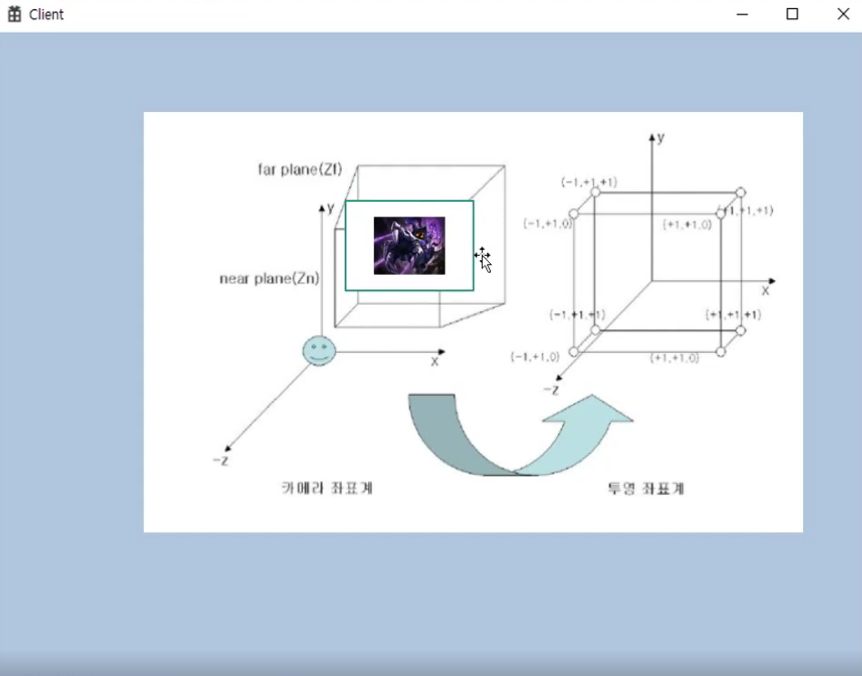
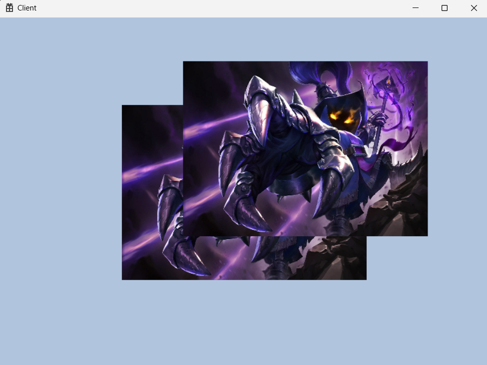
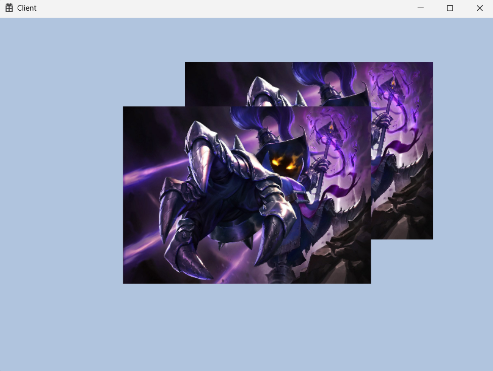

<br>

### 🚀 개요

물체에 깊이 값을 추가 할 것이다. 깊이 값이 추가 됨에따라 어떤 물체가 앞에 있고 뒤에 있는지 알 수 있게 된다.

투영의 개념을 알게 된다.


Rendering pipeline에서 Output merger 단계에서 Depth-stencil view가 사용된다.

---

### 🚀 투영



카메라 좌표계에서는 near plan과 far plan의 크기가 다르다. near이 더 작고 far는 크다.

물체의 위치에 따라 비율로 판단해서 투영 좌표계로 넘어가게 되는데 이 때 depth의 값에 따라

0 ~ 1 사이의 값을 가진다. 

3D 입체 물체 같은 경우 일단은 카메라 좌표계에서 생성되겠지만 depth값을 비교하면서 픽셀 당 화면에 출력되는 점 들이 결정된다.

---

### 🚀 현재까지 정리



이렇게 texture를 두 개를 만드는데 깊이 값에 따라 누가 앞으로가는지 설정하게 할 것이다.

지금은 (0,0,0)과 (0.25,0.25,0)의 순서대로 만들어서 깊이 값의 영향을 받지않고 그린 순서대로 만들어진 결과이다.

여기서 z값을 변경해도 변동이 없다.

---

### 🚀 Depth Stencil View

```cpp
#pragma once

class DepthStencilBuffer
{
public:
	void Init(const WindowInfo& window, DXGI_FORMAT dsvFormat = DXGI_FORMAT_D32_FLOAT);

	D3D12_CPU_DESCRIPTOR_HANDLE GetDSVCputHandle() { return _dsvHandle; }
	DXGI_FORMAT GetDSVFormat() { return _dsvFormat; }

private:
	// Depth Stencil Buffer
	ComPtr<ID3D12Resource>			_dsvBuffer;
	ComPtr<ID3D12DescriptorHeap>	_dsvHeap;
	D3D12_CPU_DESCRIPTOR_HANDLE		_dsvHandle = {};
	DXGI_FORMAT						_dsvFormat = {};
};
```

헤더파일에서 depthSenticilView만의 특이한 점은 없는 듯하다. 

리소스를 받고 descriptorHeap을 depthStencil용도로 쓸거다라고 설명만 해주면 될 듯하다.

```cpp
#include "pch.h"
#include "DepthStencilBuffer.h"
#include "Engine.h"

void DepthStencilBuffer::Init(const WindowInfo& window, DXGI_FORMAT dsvFormat)
{
	_dsvFormat = dsvFormat;

	D3D12_HEAP_PROPERTIES heapProperty = CD3DX12_HEAP_PROPERTIES(D3D12_HEAP_TYPE_DEFAULT);

	D3D12_RESOURCE_DESC desc = CD3DX12_RESOURCE_DESC::Tex2D(_dsvFormat, window.width, window.height);
	desc.Flags = D3D12_RESOURCE_FLAG_ALLOW_DEPTH_STENCIL;

	D3D12_CLEAR_VALUE optimizedClearValue = CD3DX12_CLEAR_VALUE(_dsvFormat, 1.0f, 0);

	DEVICE->CreateCommittedResource(
		&heapProperty,
		D3D12_HEAP_FLAG_NONE,
		&desc,
		D3D12_RESOURCE_STATE_DEPTH_WRITE,
		&optimizedClearValue,
		IID_PPV_ARGS(&_dsvBuffer));
	
	D3D12_DESCRIPTOR_HEAP_DESC heapDesc = {};
	heapDesc.NumDescriptors = 1;
	heapDesc.Flags = D3D12_DESCRIPTOR_HEAP_FLAG_NONE;
	heapDesc.Type = D3D12_DESCRIPTOR_HEAP_TYPE_DSV;

	DEVICE->CreateDescriptorHeap(&heapDesc, IID_PPV_ARGS(&_dsvHeap));

	_dsvHandle = _dsvHeap->GetCPUDescriptorHandleForHeapStart();
	DEVICE->CreateDepthStencilView(_dsvBuffer.Get(), nullptr, _dsvHandle);
}
```

초기화 함수에서 먼저 format을 설정해준다. 기본값인 `DXGI_FORMAT_D32_FLOAT` 이 되어있는데 32비트 모두 Depth로 사용할 것이라는 뜻이다.

여러가지 format이 존재하는데 stencil을 사용한다면 많이 사용하는 것이 `DXGI_FORMAT_D24_S8_FLOAT` 이다. 24비트는 Depth로 8비트는 Stencil로 사용하는 포멧이다.

그 후 `CreateCommittedResource` 을 하기 위해서 `D3D12_HEAP_PROPERTIES` , `D3D12_RESOURCE_DESC` 을 설명하고 있다. `CD3DX12_RESOURCE_DESC::Tex2D` 을 하는 점이 특이한데 f12로 타고 가보면 아래와 같다.

```cpp
static inline CD3DX12_RESOURCE_DESC Tex2D( 
        DXGI_FORMAT format,
        UINT64 width,
        UINT height,
        UINT16 arraySize = 1,
        UINT16 mipLevels = 0,
        UINT sampleCount = 1,
        UINT sampleQuality = 0,
        D3D12_RESOURCE_FLAGS flags = D3D12_RESOURCE_FLAG_NONE,
        D3D12_TEXTURE_LAYOUT layout = D3D12_TEXTURE_LAYOUT_UNKNOWN,
        UINT64 alignment = 0 )
```

여기서 보면 format, width, height는 필수 값인데 생각해보면 width, height는 우리가 띄우는 윈도우 창에 맞게 물체의 깊이 값과 비율 등이 맞아야되니 필요한 부품이라는 걸 알 수 있다.

DescriptorHeap의 view가 하나만 필요해도 dx12버전은 desc를 작성해야 하므로 `D3D12_DESCRIPTOR_HEAP_DESC` 를 꾸미고 있고 그 뒤 `CreateDescriptorHeap` 를 해준다. heap의 시작 주소값을 handle로 빼온 뒤 `CreateDepthStencilView` 로 depthStencilView를 생성한다.

class는 완성했고 생성을 하기 위해서 Engine으로 돌아가서 class 생성 및 get 함수를 만들고 Engine.cpp에서 Init까지 해준다.

여기까지 했다고 해도 바로 사용 할 수 있는 것은 아니고 cmdQueue에 묶어 주어야하는데 

다른 것들과 마찬가지로 RenderBegin에 묶어주게 된다.

```cpp
void CommandQueue::RenderBegin(const D3D12_VIEWPORT* vp, const D3D12_RECT* rect)
{
	_cmdAlloc->Reset();
	_cmdList->Reset(_cmdAlloc.Get(), nullptr);

	D3D12_RESOURCE_BARRIER barrier = CD3DX12_RESOURCE_BARRIER::Transition(
		_swapChain->GetCurrentBackBufferResource().Get(),
		D3D12_RESOURCE_STATE_PRESENT, // 화면 출력
		D3D12_RESOURCE_STATE_RENDER_TARGET); // 외주 결과물

	// 자리 임대 서명
	_cmdList->SetGraphicsRootSignature(ROOT_SIGNATURE.Get());
	GEngine->GetCB()->Clear();
	GEngine->GetTableDescHeap()->Clear();

	ID3D12DescriptorHeap* descHeap = GEngine->GetTableDescHeap()->GetDescriptorHeap().Get();
	_cmdList->SetDescriptorHeaps(1, &descHeap);

	_cmdList->ResourceBarrier(1, &barrier);

	// Set the viewport and scissor rect.  This needs to be reset whenever the command list is reset.
	_cmdList->RSSetViewports(1, vp);
	_cmdList->RSSetScissorRects(1, rect);

	// Specify the buffers we are going to render to.
	D3D12_CPU_DESCRIPTOR_HANDLE backBufferView = _swapChain->GetBackRTV();
	_cmdList->ClearRenderTargetView(backBufferView, Colors::LightSteelBlue, 0, nullptr);

// 아래부터는 다 new!!
	D3D12_CPU_DESCRIPTOR_HANDLE depthStencilView = GEngine->GetDepthStencilBuffer()->GetDSVCputHandle();
	_cmdList->OMSetRenderTargets(1, &backBufferView, FALSE, &depthStencilView);
	_cmdList->ClearDepthStencilView(depthStencilView, D3D12_CLEAR_FLAG_DEPTH, 1.0f, 0, 0, nullptr);
}
```

DSV는 RTV와 마찬가지로 OuputMerger단계에서 사용한다.

`ClearDepthStencilView`를 하기 위해서는 `D3D12_CPU_DESCRIPTOR_HANDLE` 이 필요하므로 생성해주었고, 이전에 만들었던 `OMSetRenderTargets` 에서 3번째 인자가 `D3D12_CPU_DESCRIPTOR_HANDLE` 을 받고 있으므로 `&depthStencilView` 를 추가 해주었다.

여기까지 해주면 RenderBegin에 묶는 것은 완료한 상태이지만 사용 할 수 있는 것은 아니다.

shader쪽으로 넘어가서  `_pipelineDesc` 를 설정해주어야 하는데 `_pipelineDesc.DepthStencilState` 를 기존에서 `_pipelineDesc.DepthStencilState = CD3DX12_DEPTH_STENCIL_DESC(D3D12_DEFAULT);` 이렇게 바꿔야 한다.

또 DepthStencilBuffer의 Format로 알려줘야해서 `_pipelineDesc.DSVFormat = GEngine->GetDepthStencilBuffer()->GetDSVFormat();` 가 추가 된다.

이렇게까지하면 이제 진짜 사용 할 수 있는데

game의 update에서 아래와 같이 코드를 바꿔주면

```cpp
{
		Transform t;
		t.offset = Vec4(0.f, 0.f, 0.2f, 0.f);
		mesh->SetTransform(t);

		mesh->SetTexture(texture);
		mesh->Render();
	}

	{
		Transform t;
		t.offset = Vec4(0.25f, 0.25f, 0.3f, 0.f);
		mesh->SetTransform(t);

		mesh->SetTexture(texture);
		mesh->Render();
	}
```

`t.offset = Vec4(0.25f, 0.25f, 0.3f, 0.f);` 가 더 깊으므로 뒤로가게 된다.

---

### 🚀 결과 화면



깊이 값이 더 큰 `t.offset = Vec4(0.25f, 0.25f, 0.3f, 0.f);` 가 더 뒤에 있는 모습을 볼 수 있다.

만약 `t.offset = Vec4(0.f, 0.f, 0.2f, 0.f);` 의 깊이 값을 0.4f 로 바꾸면 아래와 같다.

