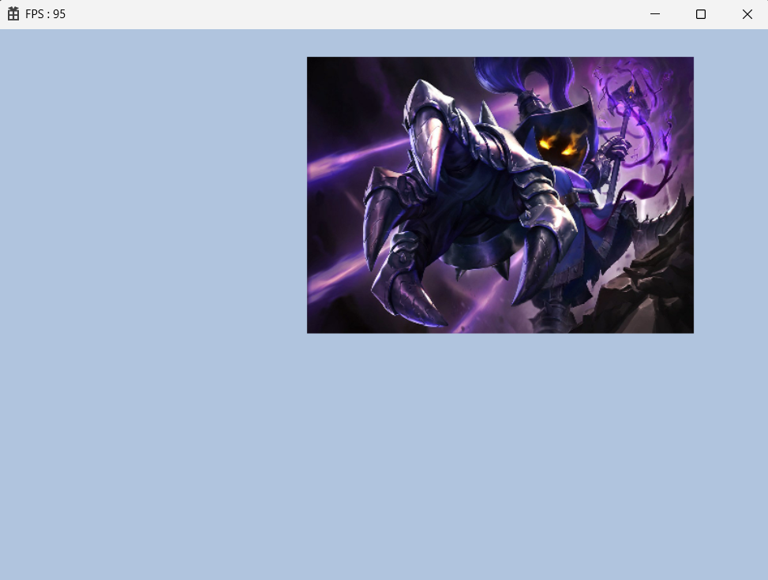

<br>

### 🚀 강의에 들어가기 앞서 고치는 점

**프레임 높이기**

```cpp
BYTE asciiKeys[KEY_TYPE_COUNT] = {};
	if (::GetKeyboardState(asciiKeys) == false)
		return;

	for (uint32 key = 0; key < KEY_TYPE_COUNT; key++)
	{
		// 키가 눌려 있으면 true
		if (asciiKeys[key] & 0x80)
		{
			KEY_STATE& state = _states[key];

			// 이전 프레임에 키를 누른 상태라면 PRESS
			if (state == KEY_STATE::PRESS || state == KEY_STATE::DOWN)
				state = KEY_STATE::PRESS;
			else
				state = KEY_STATE::DOWN;
		}
		else
		{
			KEY_STATE& state = _states[key];

			// 이전 프레임에 키를 누른 상태라면 UP
			if (state == KEY_STATE::PRESS || state == KEY_STATE::DOWN)
				state = KEY_STATE::UP;
			else
				state = KEY_STATE::NONE;
		}
	}
```

프레임이 너무 낮아서 다른 방법을 사용하였다.  이게 왜 좋은지는 모름.

### 🚀 이번 강의에서 하고싶은 것

1. shader와 texture를 하나로 묶은 Material을 만들고 싶다.
2. constantBuffer를 용도에 맞게 여러개를 만들고 싶다.

b1, t0를 Material용도로 사용하기 위해서 constantBuffer를 배열로 만들 것임.
사전 작업으로 type과 count할 enum 생성

```cpp
enum class CONSTANT_BUFFER_TYPE : uint8
{
	TRANSFORM,
	MATERIAL,
	END
};

enum
{
	CONSTANT_BUFFER_COUNT = static_cast<uint8>(CONSTANT_BUFFER_TYPE::END),
};
```

그리고 레지스터 번호에 따라 역할이 달라지기 때문에 constantbuffer의 init의 매개변수에 `CBV_REGISTER reg` 를 추가한다. 이에 따라 CBV_REGISTER는 멤버변수로 `CBV_REGISTER _reg = {};` 이렇게 들고있게 된다. 당연히 Init 내부에서는 `_reg = reg;`를 해줘야 한다.

pushdata에서 handle을 뽑고 SetCBVs나 SetSRV를 한번에 하게 만들어야 됨.(레지스터마다 역할이 생겨서 실수 할 여지가 생기므로)
pushdata함수 속으로 setCbv를 넣으면 된다.

이렇게 변경하면 구조가 와장창 바뀌므로 빌드를 하면 에러가 막 생기는데
하나하나 고치면 된다.

처음에 Engine의 ContantBuffer를 삭제를 한다. 이유는 하나만 사용하는게 아니라 여러개를 사용하기 때문이다.
그에 따라 `CreateContantBuffer` 라는 함수를 만든다.

```cpp
void Engine::CreateConstantBuffer(CBV_REGISTER reg, uint32 bufferSize, uint32 count)
{
	uint8 typeInt = static_cast<uint8>(reg);
	assert(_constantBuffers.size() == typeInt);

	shared_ptr<ConstantBuffer> buffer = make_shared<ConstantBuffer>();
	buffer->Init(reg, bufferSize, count);
	_constantBuffers.push_back(buffer);
}
```

`vector<shared_ptr<ConstantBuffer>> _constantBuffers;` 이렇게 멤버변수로 새로 만들고 Get함수도 구현 해준다. 함수 내부를 보면 register의 번호를 받은 후 안전 체크, `make_shared<ConstantBuffer>();` 로 생성을 하면서 동시에 Init까지 하고 push_back으로 배열에 쏙 넣는 함수.

이렇게 준비가 됐으면 constantBuffer를 만들려면 이전에는 _cb를 통해서 했지만 이제는 CreateConsantBuffer로 레지스터에 따라서 만들어주면 된다. 이번강의인 Material을 만들기 위해서 Material 클래스를 만든다.

```cpp
#pragma once

class Shader;
class Texture;

enum
{
	MATERIAL_INT_COUNT = 5,
	MATERIAL_FLOAT_COUNT = 5,
	MATERIAL_TEXTURE_COUNT = 5,
};

struct MaterialParams
{
	void SetInt(uint8 index, int32 value) { intParams[index] = value; }
	void SetFloat(uint8 index, float value) { floatParams[index] = value; }

	array<int32, MATERIAL_INT_COUNT> intParams;
	array<float, MATERIAL_FLOAT_COUNT> floatParams;
};

class Material
{
public:
	shared_ptr<Shader> GetShader() { return _shader; }

	void SetShader(shared_ptr<Shader> shader) { _shader = shader; }
	void SetInt(uint8 index, int32 value) { _params.SetInt(index, value); }
	void SetFloat(uint8 index, float value) { _params.SetFloat(index, value); }
	void SetTexture(uint8 index, shared_ptr<Texture> texture) { _textures[index] = texture; }

	void Update();

private:
	shared_ptr<Shader>	_shader;
	MaterialParams		_params;
	array<shared_ptr<Texture>, MATERIAL_TEXTURE_COUNT>	_textures;
};
```

구조를 보면 우리가 원하는 shader와 texture를 한 묶음으로 관리하고 싶으니 멤버변수로 들어가 있는 것이 특징이며 실제로 사용 할 때 편하려고 `MaterialParams` 구조체를 만들어준걸 볼 수 있다.

여기서 `array`는 벡터와 비슷하지만 고정된 배열이고 버그를 잡을 때 유용한 친구이다.

```cpp
#include "pch.h"
#include "Material.h"
#include "Engine.h"

void Material::Update()
{
	// CBV 업로드
	CONSTANTBUFFER(CONSTANT_BUFFER_TYPE::MATERIAL)->PushData(&_params, sizeof(_params));

	// SRV 업로드
	for (size_t i = 0; i < _textures.size(); i++)
	{
		if (_textures[i] == nullptr)
			continue;

		SRV_REGISTER reg = SRV_REGISTER(static_cast<int8>(SRV_REGISTER::t0) + i);
		GEngine->GetTableDescHeap()->SetSRV(_textures[i]->GetCpuHandle(), reg);
	}

	// 파이프라인 세팅
	_shader->Update();
}
```

업데이트 함수에서 CBV, SRV 파이프라인 세팅까지 한 함수에 넣어서 따로따로 관리를 안하도록 만들었다.

```cpp
cbuffer MATERIAL_PARAMS : register(b1)
{
    int int_0;
    int int_1;
    int int_2;
    int int_3;
    int int_4;
    float float_0;
    float float_1;
    float float_2;
    float float_3;
    float float_4;
}

Texture2D tex_0 : register(t0);
Texture2D tex_1 : register(t1);
Texture2D tex_2 : register(t2);
Texture2D tex_3 : register(t3);
Texture2D tex_4 : register(t4);
```

shader에서 변경사항이 생기고 다시 빌드를하고 에러를 잡으면 되는데 Material을 만들어 줬지 사용은 안하고 있으므로 Mesh내부에 들고 있도록하면서 render에서 사용하도록 만들었다.

```cpp
#pragma once

class Material;

class Mesh
{
public:
	void Init(const vector<Vertex>& vertexBuffer, const vector<uint32>& indexBuffer);
	void Render();

	void SetTransform(const Transform& t) { _transform = t; }
	void SetMaterial(shared_ptr<Material> mat) { _mat = mat; }

private:
	void CreateVertexBuffer(const vector<Vertex>& buffer);
	void CreateIndexBuffer(const vector<uint32>& buffer);

private:
	ComPtr<ID3D12Resource>		_vertexBuffer;
	D3D12_VERTEX_BUFFER_VIEW	_vertexBufferView = {};
	uint32						_vertexCount = 0;

	ComPtr<ID3D12Resource>		_indexBuffer;
	D3D12_INDEX_BUFFER_VIEW		_indexBufferView = {};
	uint32						_indexCount = 0;

	Transform _transform = {};
	shared_ptr<Material> _mat = {};
};
```

material을 들고 있고 render에서 `_mat->Update();` 만 해주면 따로따로 하지 않고 한번에 처리 된다.
코드를 사용하기 위해 shader에서 `ouput.pos.x += float_0` 처럼 테스트 용을 채우고 game.cpp에서 

```cpp
mesh->Init(vec, indexVec);

shared_ptr<Shader> shader = make_shared<Shader>();
shared_ptr<Texture> texture = make_shared<Texture>();
shader->Init(L"..\\Resources\\Shader\\default.hlsli");
texture->Init(L"..\\Resources\\Texture\\veigar.jpg");

shared_ptr<Material> material = make_shared<Material>();
material->SetShader(shader);
material->SetFloat(0, 0.3f);
material->SetFloat(1, 0.4f);
material->SetFloat(2, 0.3f);
material->SetTexture(0, texture);
mesh->SetMaterial(material);

GEngine->GetCmdQueue()->WaitSync();
```

이런식으로 사용하게 된다. 빌드를하고 다시 에러가 나오는데 여기서 기존에 사용했던 방식들을 다 제거 해주면 모든 처리가 끝난다.

---

### 🚀 결과 화면



변한건 거의 없지만 Material로 b1과 t0을 사용을 한 것.