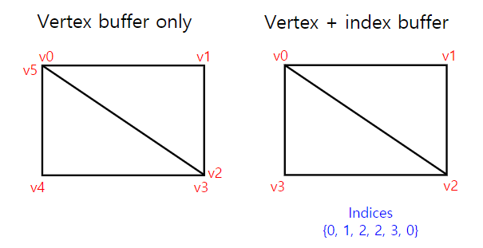
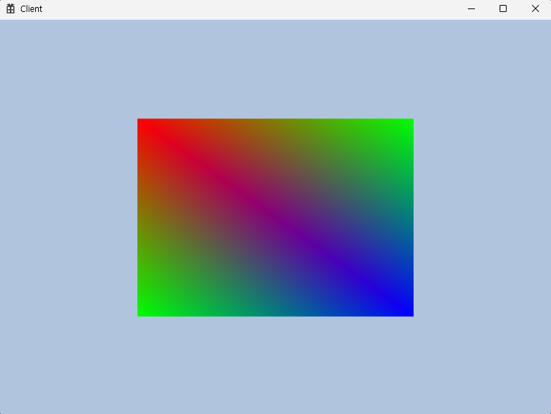

<br>



vertex buffer만 사용할 경우 사각형 만들기를 할 때 총 6개의 vertex가 필요하지만

vertex와 index buffer를 같이 사용하면 4개의 vertex만 있어도 된다.

index buffer는 vertex에 번호를 매겨주는 것과 같다.

---

### 🚀 Mesh

```cpp
class Mesh
{
public:
	void Init(const vector<Vertex>& vertexBuffer, const vector<uint32>& indexBuffer); // mod!!
	void Render();

	void SetTransform(const Transform& t) { _transform = t; }

private:
	void CreateVertexBuffer(const vector<Vertex>& buffer); // new!!
	void CreateIndexBuffer(const vector<uint32>& buffer); // new!!

private:
	ComPtr<ID3D12Resource>		_vertexBuffer;
	D3D12_VERTEX_BUFFER_VIEW	_vertexBufferView = {};
	uint32						_vertexCount = 0;

	ComPtr<ID3D12Resource>		_indexBuffer; // new!!
	D3D12_INDEX_BUFFER_VIEW		_indexBufferView = {}; // new!!
	uint32						_indexCount = 0; // new!!

	Transform _transform = {};
};
```

index buffer는 vertex buffer와 마찬가지로 `ComPtr<ID3D12Resource>` `D3D12_INDEX_BUFFER_VIEW` 를 가지고 있어야 하고 총 인덱스 개수를 넣은 `_indexCount` 로 구성되어있다.

```cpp
void Mesh::Render()
{
	CMD_LIST->IASetPrimitiveTopology(D3D_PRIMITIVE_TOPOLOGY_TRIANGLELIST);
	CMD_LIST->IASetVertexBuffers(0, 1, &_vertexBufferView);
	CMD_LIST->IASetIndexBuffer(&_indexBufferView); // new!!

	// TODO 진짜 그릴 애들 설정
	// 1. Buffer에다가 데이터 세팅
	// 2. TableDescHeap에다가 CBV 전달
	// 3. 모든 세팅이 끝났으면 TableDescHeap 커밋
	{
		D3D12_CPU_DESCRIPTOR_HANDLE handle = GEngine->GetCB()->PushData(0, &_transform, sizeof(_transform));
		GEngine->GetTableDescHeap()->SetCBV(handle, CBV_REGISTER::b0);
	}

	GEngine->GetTableDescHeap()->CommitTable();

	//CMD_LIST->DrawInstanced(_vertexCount, 1, 0, 0);
	CMD_LIST->DrawIndexedInstanced(_indexCount, 1, 0, 0, 0); // new!!
}
```

Input Assembly 단계에서 `IASetIndexBuffer` 를 추가해주고 그리는 방식을 vertex에서 index 형식으로 바꾸기 위해 `DrawIndexedInstanced` 으로 변경 됨.

```cpp
void Mesh::Init(const vector<Vertex>& vertexBuffer, const vector<uint32>& indexBuffer)
{
	CreateVertexBuffer(vertexBuffer);
	CreateIndexBuffer(indexBuffer);
}
```

초기화 함수에서는 `CreateVertexBuffer` `CreateIndexBuffer` 를 해주도록 변경하였고 원래 있던 vertexBuffer는 `CreateVertexBuffer` 로 빠지게 되었다.

```cpp
void Mesh::CreateVertexBuffer(const vector<Vertex>& buffer)
{
	_vertexCount = static_cast<uint32>(buffer.size());
	uint32 bufferSize = _vertexCount * sizeof(Vertex);

	D3D12_HEAP_PROPERTIES heapProperty = CD3DX12_HEAP_PROPERTIES(D3D12_HEAP_TYPE_UPLOAD);
	D3D12_RESOURCE_DESC desc = CD3DX12_RESOURCE_DESC::Buffer(bufferSize);

	DEVICE->CreateCommittedResource(
		&heapProperty,
		D3D12_HEAP_FLAG_NONE,
		&desc,
		D3D12_RESOURCE_STATE_GENERIC_READ,
		nullptr,
		IID_PPV_ARGS(&_vertexBuffer));

	void* vertexDataBuffer = nullptr;
	CD3DX12_RANGE readRange(0, 0);
	_vertexBuffer->Map(0, &readRange, &vertexDataBuffer);
	::memcpy(vertexDataBuffer, &buffer[0], bufferSize);
	_vertexBuffer->Unmap(0, nullptr);

	_vertexBufferView.BufferLocation = _vertexBuffer->GetGPUVirtualAddress();
	_vertexBufferView.StrideInBytes = sizeof(Vertex);
	_vertexBufferView.SizeInBytes = bufferSize;
}
```

함수의 큰 그림

`CreateCommittedResource` 로 `_vertexBuffer` 에 리소스 채우기, `Map` `Unmap` 으로 `_vertexBuffer` 내용물을 채운 후, gpu 단계에 있으니 `_vertexBufferView` 를 통해서 설정

`_vertexCount` `bufferSize` `heapProperty` `desc` 등등은 함수를 채워주기 위한 재료값

```cpp
void Mesh::CreateIndexBuffer(const vector<uint32>& buffer)
{
	_indexCount = static_cast<uint32>(buffer.size());
	uint32 bufferSize = _indexCount * sizeof(uint32);

	D3D12_HEAP_PROPERTIES heapProperty = CD3DX12_HEAP_PROPERTIES(D3D12_HEAP_TYPE_UPLOAD);
	D3D12_RESOURCE_DESC desc = CD3DX12_RESOURCE_DESC::Buffer(bufferSize);

	DEVICE->CreateCommittedResource(
		&heapProperty,
		D3D12_HEAP_FLAG_NONE,
		&desc,
		D3D12_RESOURCE_STATE_GENERIC_READ,
		nullptr,
		IID_PPV_ARGS(&_indexBuffer));

	void* indexDataBuffer = nullptr;
	CD3DX12_RANGE readRange(0, 0);
	_indexBuffer->Map(0, &readRange, &indexDataBuffer);
	::memcpy(indexDataBuffer, &buffer[0], bufferSize);
	_indexBuffer->Unmap(0, nullptr);

	_indexBufferView.BufferLocation = _indexBuffer->GetGPUVirtualAddress();
	_indexBufferView.Format = DXGI_FORMAT_R32_UINT;
	_indexBufferView.SizeInBytes = bufferSize;
}
```

CreateIndexBuffer는 CreateVertexBuffer와 마찬가지로 같은 버퍼를 만들지만 이름만 바뀌었을 뿐이다. vector값이 uint32인 정도의 차이이다. 버퍼는 거의 비슷하지만 정보를 들고있는 버퍼를 어떻게 사용할 것인가가 문제. Mesh의 Render에서 사항을 적어 두었다.

---

### 🚀 Game에서 실제 적용

```cpp
void Game::Init(const WindowInfo& info)
{
	GEngine->Init(info);

	vector<Vertex> vec(4);
	vec[0].pos = Vec3(-0.5f, 0.5f, 0.5f);
	vec[0].color = Vec4(1.f, 0.f, 0.f, 1.f);
	vec[1].pos = Vec3(0.5f, 0.5f, 0.5f);
	vec[1].color = Vec4(0.f, 1.f, 0.f, 1.f);
	vec[2].pos = Vec3(0.5f, -0.5f, 0.5f);
	vec[2].color = Vec4(0.f, 0.f, 1.f, 1.f);
	vec[3].pos = Vec3(-0.5f, -0.5f, 0.5f);
	vec[3].color = Vec4(0.f, 1.f, 0.f, 1.f);

	// 삼각형의 감기 순서는 시계 방향
	vector<uint32> indexVec;
	{
		indexVec.push_back(0);
		indexVec.push_back(1);
		indexVec.push_back(2);
	}
	{
		indexVec.push_back(3);
		indexVec.push_back(0);
		indexVec.push_back(2);
	}

	mesh->Init(vec, indexVec);

	shader->Init(L"..\\Resources\\Shader\\default.hlsli");

	GEngine->GetCmdQueue()->WaitSync();
}
```

여기서 `vector<Vertex> vec(4);` 로 vertexBuffer를 만들고 채워준 후 `vector<uint32> indexVec;` 로 indexBuffer까지 만든다. indexBuffer는 정보 값이 `uint32` 이므로 정점들의 점 번호를 들고 삼각형 만들기를 하는 중이다.

`mesh->Init(vec, indexVec);` 역시 매개변수가 달라짐에 따라 indexVec이 추가 되었다.

---

### 🚀 결과 화면



VertexBuffer에 각 꼭지점의 좌표를 넣어주고 IndexBuffer는 vertex의 번호로 삼각형을 그린다.