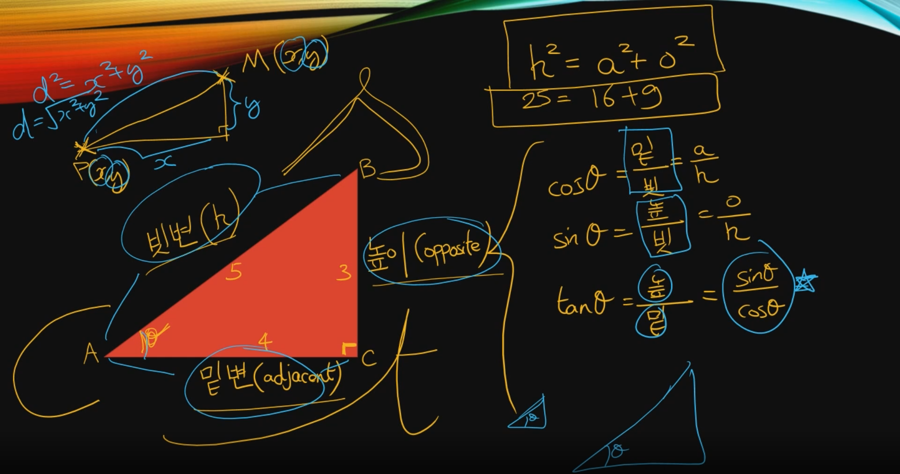
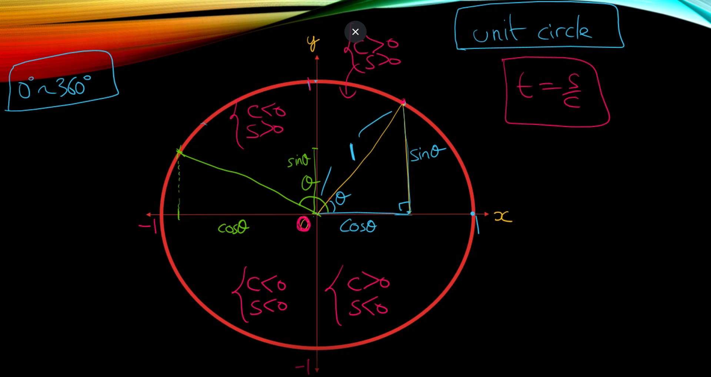
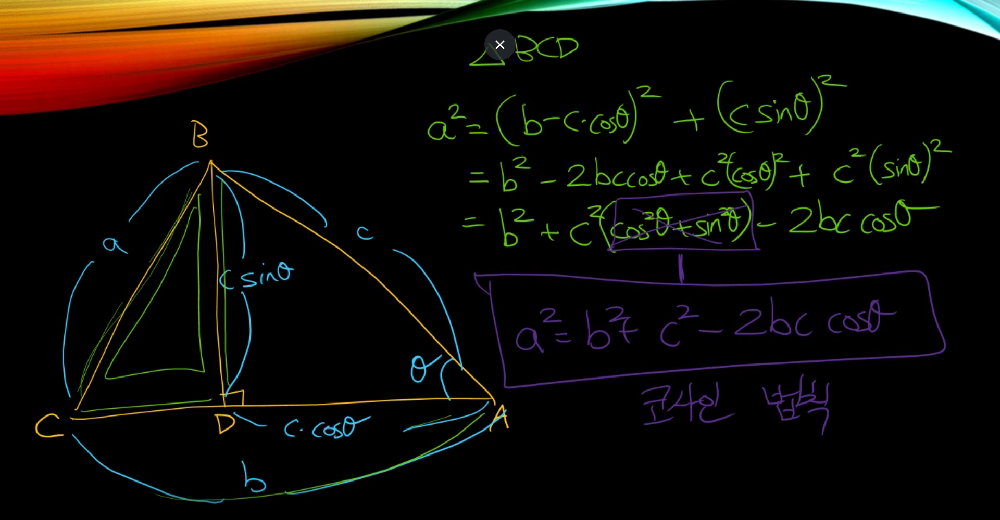
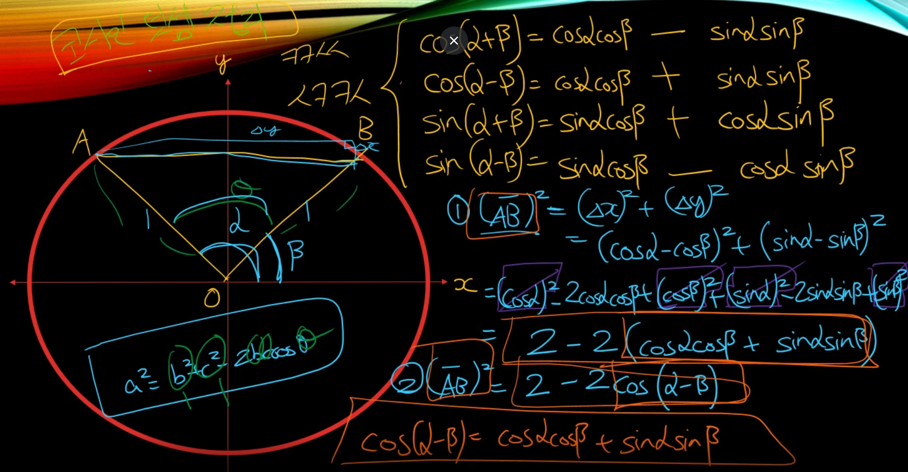

 

---

$tanθ = sinθ / cosθ$

동심원을 이용해서 삼각함수의 영역 넓히기

1 rad (1 라디안) = 호의 길이가 1이 되게하는 각

$1rad = 57°$ 와 비슷.

$360° = 2π$

$180° = π$

$π / 3 = 60°$

$π / 4 = 45°$

$π / 6 = 30°$

$cos(θ) = cos(-θ)$

$sin(θ) = -sin(-θ)$

$sin(θ + π / 2) = cos(θ)$

$sin(θ - π / 2) = -cos(θ)$

**삼각함수의 역함수**

0 ~ π 까지

$arcsin$

$arccos$

-π/2 ~ π/2 까지

$arctan$

**코사인 법칙**

$a^2 = (b - c * cosθ)^2 + (C * sinθ)^2$

$= b^2 - 2bc*cosθ + c^2(cosθ)^2 + c^2(sinθ)^2$

$= b^2 + c^2(cos^2θ + sin^2θ) - 2bc*cosθ$

$cos^2θ + sin^2θ = 1$ 이므로

$a^2 = b^2 + c^2 - 2bc*cosθ$

**코사인 덧셈 정리**

코코싸싸

싸코코싸

$cos(α + β) = cosα*cosβ - sinα*sinβ$

$cos(α - β) = cosα*cosβ + sinα*sinβ$

$sin(α + β) = sinα * cosβ + cosα * sinβ$

$sin(α - β) = sinα * cosβ - cosα * sinβ$

